## Définition des objectifs {#anchor-step-0}
Ce TP vise à effectuer une segmentation 3D et un contrôle de forme sur des objets polyédriques, c'est-à-dire à vérifier si ces objets sont corrects par rapport à un modèle géométrique de référence et/ou présentent des défauts (trous, résidus, etc.).

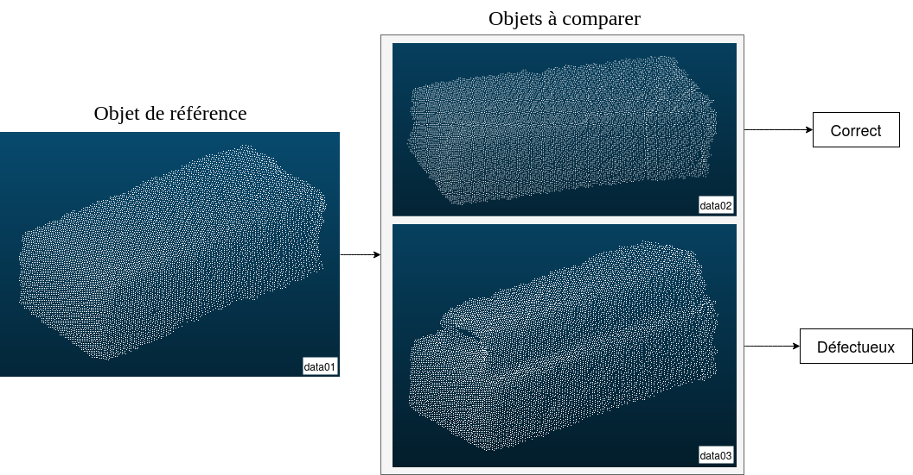

Pour cela, il faut au préalable construire ce modèle de référence à partir d'une image RGB-D d'un objet sans défaut. Ensuite, pour toute vue d'un objet inconnu (dit "de test"), nous devons le segmenter à partir de l'arrière-plan et le comparer avec le modèle de référence. Ce processus de vérification de la forme doit être indépendant du point de vue et,
exige donc l'enregistrement de chaque nuage de points associé par rapport à celui de référence.

{}
Nous proposons de décomposer cet objectif en trois étapes :

- [étape 1](#anchor-step-1) : **extraire les points 3D** des objets à comparer (à la fois objets de référence et de test) en supprimant tous les points de la scène n'appartenant pas à l'objet. Pour éviter un processus redondant, cette étape sera à réaliser seulement sur la scène de référence contenue dans `data01.xyz` ; cela a déjà été réalisé sur les objets à contrôler, et stocké dans les fichiers `data02_object.xyz` et `data03_object.xyz`.
- [étape 2](#anchor-step-2) : **enregistrer** les points de chaque objet de test vers le modèle de référence afin de les comparer *i.e.* aligner leurs nuages de points 3D respectifs sur le repère de coordonnées de référence.
- [étape 3](#anchor-step-3) : **comparer** les modèles de contrôle et de référence et conclure sur les potentiels défauts des modèles de contrôle.
{}

## ***Etape 1*** : extraction du modèle 3D de la scène de référence

La première étape du TP consiste à extraire le nuage de points du modèle de référence à partir de la scène RGB-D acquise avec une Kinect :

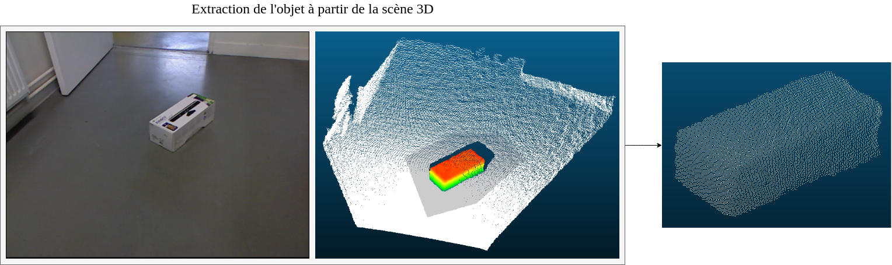

Cette étape vise à calquer une surface plane sur le plan du sol, et à ne garder que la boite du centre en calculant la distance de chacun de ses points par rapport à ce plan et en y appliquant un seuil de filtrage.

Pour cela, ouvrez CloudCompare (le logiciel principal, pas le viewer) et importez les points de la scène `data01.xyz`. Sélectionnez le nuage en cliquant dessus dans le *workspace*.
A l'aide de l'outil de segmentation (**Edit > Segment**, ou bien directement le raccourci "ciseaux" dans la barre des raccourcis), divisez le nuage en trois sous-ensembles afin d'en extraire le plan du sol et une zone grossière autour de la boite.
 Le résultat obtenu est illustré par la figure suivante :

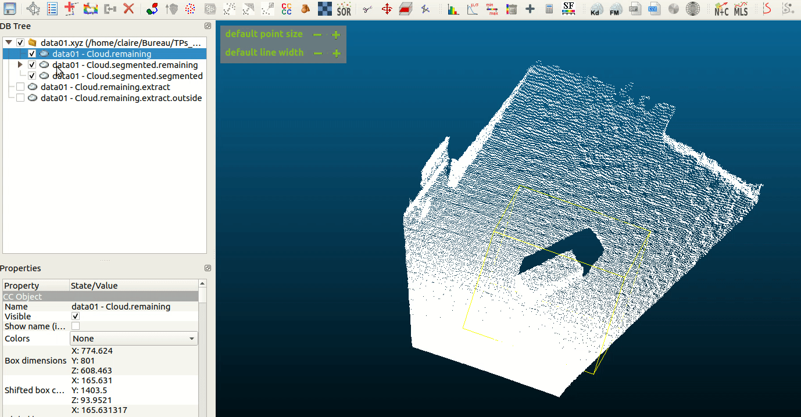

{}
Dans CloudCompare, pour travailler sur un nuage de points, il faut que la ligne lui correspondant soit sélectionnée dans le *workspace*. Vous savez si le nuage est sélectionné lorsqu'une boite jaune s'affiche autour.

Le fait de cocher la case ne sélectionne pas le nuage, elle le rend simplement visible/invisible dans l'affichage.
{}

Créez une surface calquée sur le nuage du plan du sol à l'aide de l'outil **Tools > Fit > Plane**. 
En sélectionnant le plan nouvellement créé et le nuage qui contient la boite, il est maintenant possible de calculer, pour chacun des points de ce nuage, sa distance au plan à l'aide de l'outil **Tools > Distances > Cloud/Mesh Distance** :

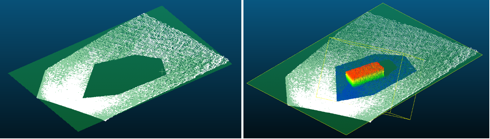

L'outil de distance ajoute un quatrième champ à chacun des points du nuage : la distance nouvellement calculée. En allant dans les propriétés du nuage, filtrez les points par rapport à ce champ scalaire pour ne garder que les points appartenant à la boite :

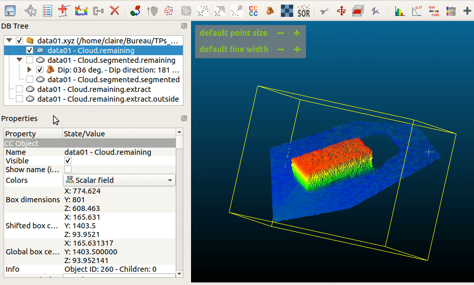

En cliquant sur *split*, deux nuages sont créés, correspondant aux deux côtés du filtrage :

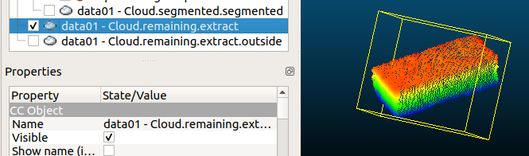

Assurez-vous que le nuage nouvellement créé contient environ 10,000 points (le nombre de points est accessible dans le panneau des propriétés sur la gauche).

Supprimez le champ scalaire de la distance *via* **Edit > Scalar fields > Delete**. Sélectionnez seulement le nuage de la boite avant de l'enregistrer au format ASCII Cloud sous le nom `data01_segmented.xyz` dans le dossier `data` du TP. 

{}
Par précaution, sauvegardez votre projet CloudCompare : pensez à **sélectionner tous les nuages de points**, et à sauvegarder le projet au format CloudCompare.
{}

## ***Etape 2*** : enregistrement des points 3D

Si vous avez ouvert les scènes complètes `data02.xyz` et `data03.xyz` dans CloudCompare, vous aurez remarqué que chaque scène a été prise d'un point de vue légèrement différent, et que les objets eux-mêmes ont bougé :

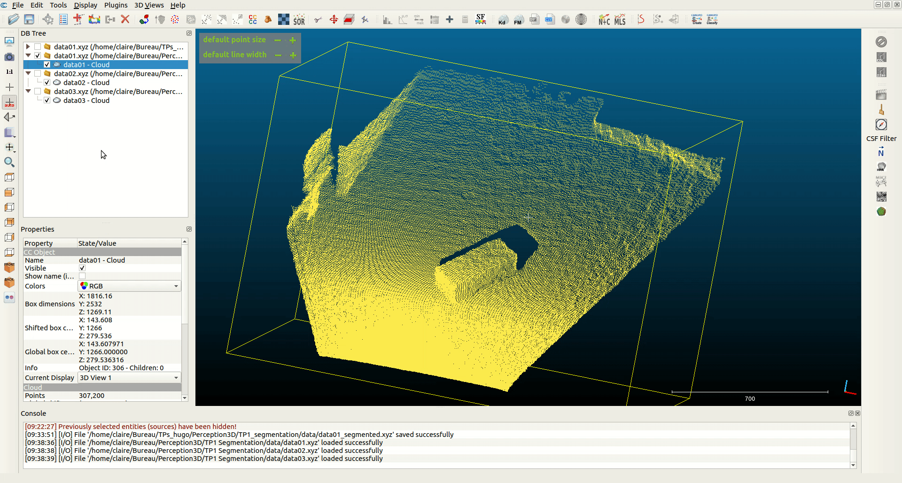

Pour pouvoir comparer les modèles entre eux, on propose de les superposer et de calculer leur distance cumulée point à point. Plus cette distance est faible, plus les modèles se superposent et se ressemblent ; plus elle est grande, plus les modèles diffèrent.
L'exemple suivant montre la superposition du modèle correct sur le modèle de référence précédemment extrait :

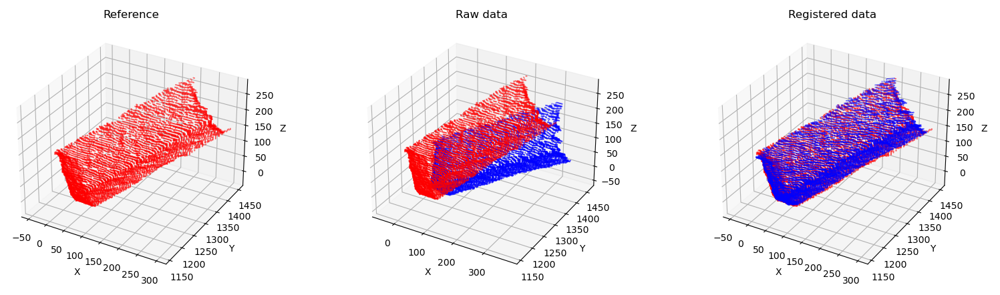

Le fait de transformer les points d'un modèle via une matrice de rotation/translation pour venir le superposer sur un autre nuage s'appelle *l'enregistrement des points*. 
L'algorithme ***Iterative Closest Point*** permet cet enregistrement, et nous proposons de l'utiliser en Python. 
Le code à modifier se situe uniquement dans `qualitycheck.py`, l'objectif étant d'appliquer ICP à la fois sur le modèle correct `data02_object.xyz`, et sur le modèle défectueux `data03_object.xyz`.

### Chargement des modèles
La première partie du code charge les modèles `.xyz` extraits avec CloudCompare, stocke le modèle de référence dans la variable `ref` et le modèle à comparer dans la variable `data`.
Pour exécuter le code soit sur `data02_object`, soit sur `data03_object`, il suffit de commenter la ligne correspondante (22 ou 23).

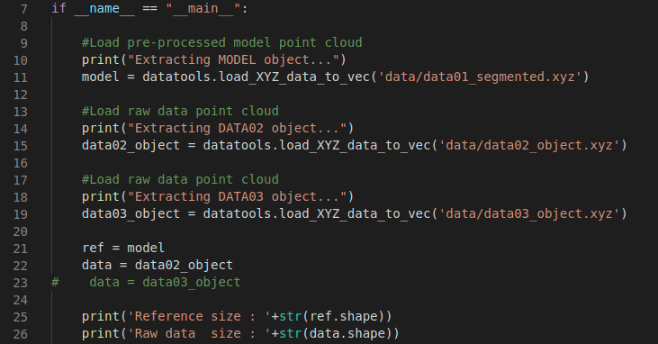

### Appel à ICP

La deuxième partie du code consiste à coder l'appel à la fonction `icp` de la librairie `icp`... 

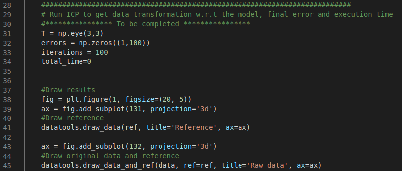

...et à stocker le retour de la fonction dans les variables `T`, `errors`, `iterations` et `total_time` comme défini par l'en-tête de définition de la fonction dans le fichier `icp.py` :

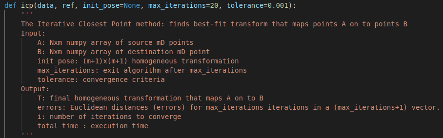

### Transformation du modèle 

La matrice `T` de transformation issue d'ICP est la matrice de passage homogène permettant de calquer le modèle `data`, passé en paramètre de la fonction `icp`, sur le modèle `ref`.
Pour rappel, l'application d'une matrice homogène pour transformer un ensemble de points d'un repère initial \\(\mathcal{R_i}\\) vers un repère final \\(\mathcal{R_f}\\) s'effectue de la manière suivante :

$$P_f^{(4 \times N)} = T^{(4 \times 4)} . P_i^{(4 \times N)}$$

Dans le code, la troisième partie consiste donc à appliquer la matrice de transformation au modèle à comparer :

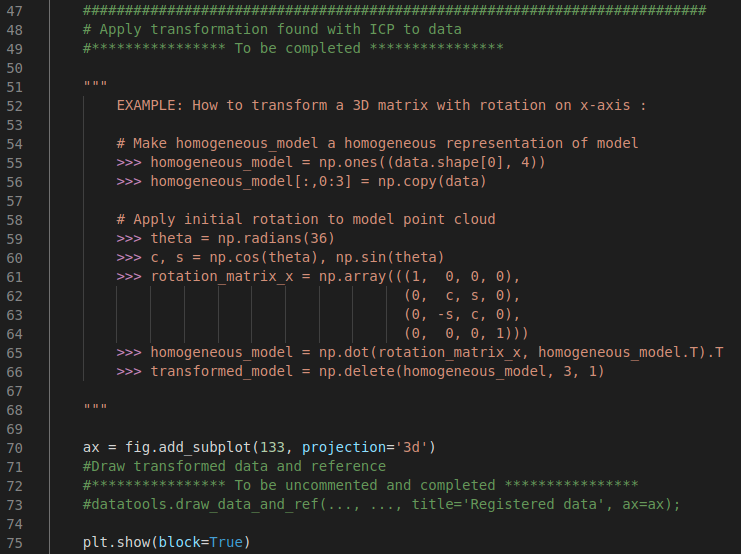

{}
La variable `data` est un tableau de taille \\(N \times 3\\), \\(N\\) étant le nombre de points du modèle et 3 ses coordonnées \\(X\\), \\(Y\\) et \\(Z\\).

Il faut veiller à lui ajouter une coordonnée homogène et appliquer les transposées nécessaires pour que la multiplication de matrices fonctionne.
Aidez-vous de l'exemple donné dans le code pour réaliser cette étape.
{}

Vous pouvez ensuite afficher le résultat en décommentant et complétant la ligne `datatools.draw_data...`.

### Affichage de l'erreur
Décommentez et affichez l'erreur dans la dernière partie du code, en changeant les "..." par les variables correspondantes :

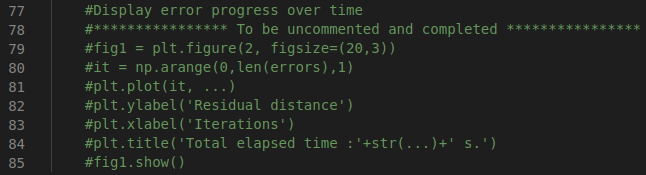

## ***Etape 3*** : comparaison des modèles

Comparez l'application d'ICP sur les modèles `data02` et `data03`, remarquez l'évolution de l'erreur et les différences de valeurs.
Que représente cette erreur ? Que peut-on dire des deux modèles ? En vous appuyant sur les erreurs, quel seuil de décision pourriez-vous choisir pour déterminer si un modèle est défectueux ou non ?

### ICP dans CloudCompare

L'algorithme ICP peut également être utilisé directement dans CloudCompare. Ouvrez-le et importez `data01_segmented.xyz`, `data02_object.xyz` et `data03_object.xyz`.

Sélectionnez par exemple les nuages de `data01_segmented` et `data02_object`, utilisez l'outil **Tools > Registration > Fine registration (ICP)**. Assurez-vous que la référence est bien `data01` et appliquez ICP.
Son exécution vous renvoie la matrice de transformation calculée par l'algorithme, et l'applique à l'objet.

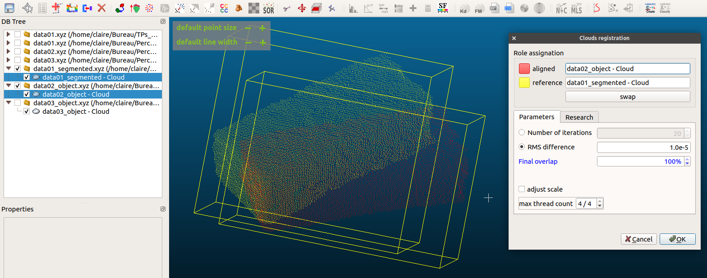

On peut ainsi, toujours en sélectionnant les deux nuages, calculer la distance entre les points avec **Tools > Distance > Cloud/Cloud Distance**. Assurez-vous que la référence est bien `data01` et cliquez sur OK/Compute/OK.
Sélectionnez `data02_object` et affichez l'histogramme de ses distances au nuage de référence *via* **Edit > Scalar fields > Show histogram**.

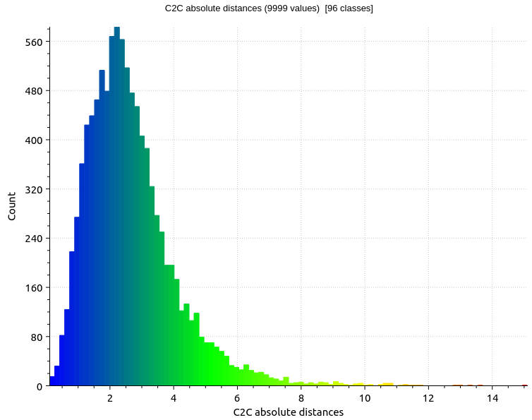

Faites la même chose avec `data03_object` et comparez les histogrammes. Comment les interprétez-vous ? Comment pouvez-vous les comparer ?
