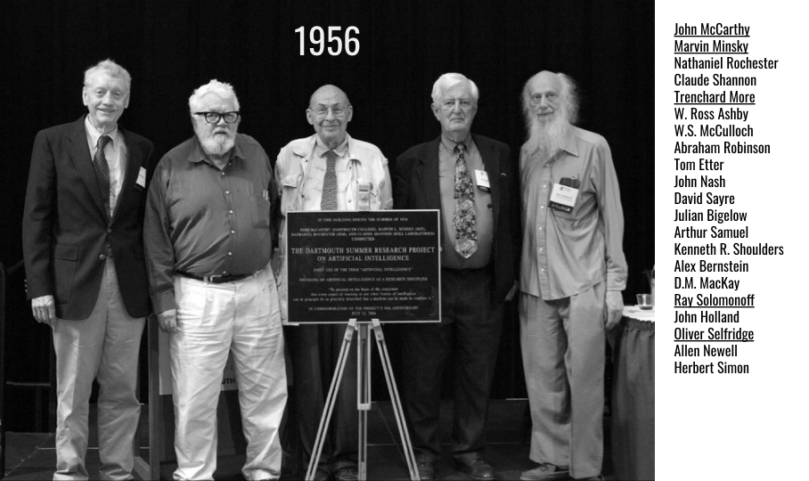
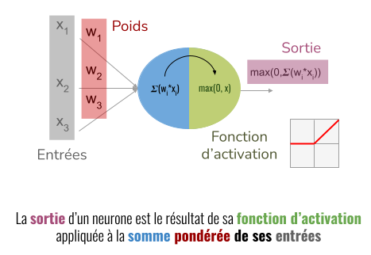
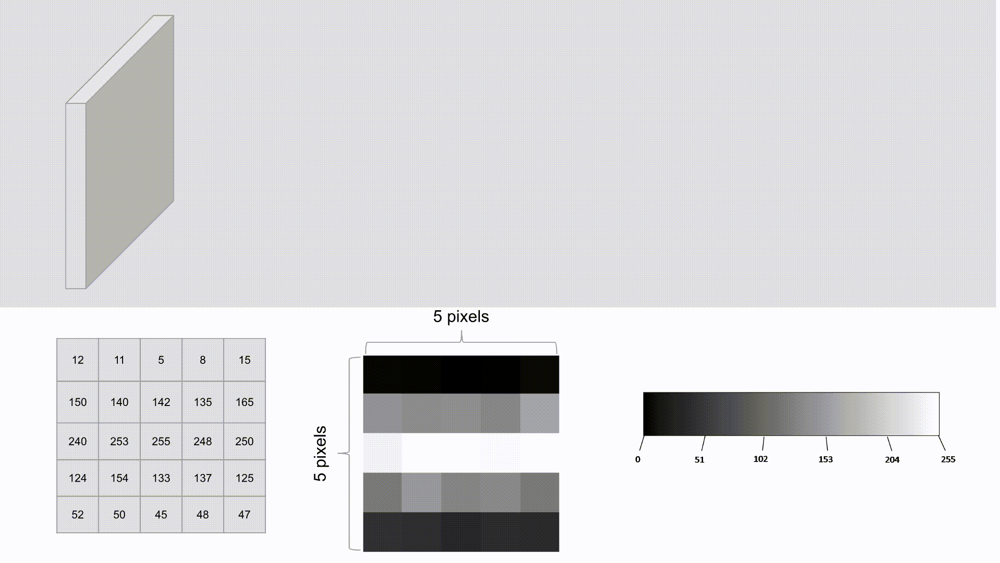



> ## Objectifs pédagogiques
>
>Ce premier cours a pour objectif de répondre aux trois questions suivantes autour du *deep learning* : 
>   * **à quoi ça sert ?** 
>   * **pourquoi c'est techniquement intéressant ?**
>   * **quels en sont les grands principes ?**
 

## Le cours

### D'où vient le *deep learning* ?

#### L'IA est là... depuis longtemps

>Introduction à l’IA --> cf slides RDV innovation

#### Le contexte technique du *deep learning*

>slide apprentissage supervisé/machine learning tout ca

#### Quelle application de l'IA à la vision par ordinateur ?

>Différentes tâches en deep learning vision : classif/detection/semantic segmentation/instance segmentation/estimation de profondeur, etc.

#### De l'apprentissage machine classique au *deep learning*

>messages :
>* historique (stagiaire McCarthy) pour amener à l’extraction de caractéristiques : d’abord des règles, puis extraction de caractéristiques --> HOG+SVM
>* pourquoi les SVM à l’époque alors que les MLP existaient déjà ? --> méthodes type SVM avaient de meilleurs résultats et temps d’apprentissage plus courts
>* meme si MLP existaient déjà et pas ouf en classif, l’extraction automatique des caractéristiques (grâce à l’exécution possible sur machines plus puissantes) a explosé le reste parce que tout est fait dans la boucle d’apprentissage

### What is a CNN? Obviously good news... 

> * Neurone > activations > produit de convolution > réseau de convolution :
> * visualisation des couches de convolution : https://adamharley.com/nn_vis/cnn/3d.html
> * illustrer la spatialité/receptive field de la convolution
> * backbone : principe utilisé tout le temps = reduire resolution et augmenter le nombre de canaux

#### A l'origine est le neurone 

#### Fonction d'activation
#### Convolution

#### Réseau de convolution

> ## Les termes à retenir
> ``CNN`` <mark>CNN *(Convolutional Neural Network)*</mark> <mark>Neurone</mark> <mark>Carte d'activation, de caractéristiques, ou *feature map*</mark> <mark>Neurone</mark> <mark>Neurone</mark> <mark>Neurone</mark> <mark>Neurone</mark> 