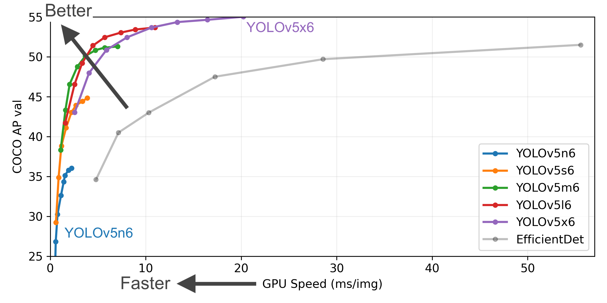
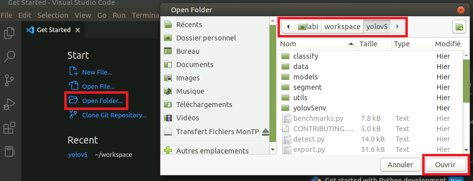

## Objectifs pédagogiques

L'objectif de ces séances de travaux pratiques est de toucher à toutes les étapes de l'ingénierie du *deep learning*, à savoir :
- l'**acquisition** et l'**annotation** de données, 
- l'**apprentissage** de réseaux de convolution, 
- l'**évaluation** des performances de la tâche apprise,
- la **visualisation** des résultats obtenus.

Pour cela, notre point de départ sera le détecteur d'objets très largement connu et utilisé par les communautés scientifique mais aussi industrielle : [YOLO](https://arxiv.org/pdf/1506.02640.pdf) (You Only Look Once). Nous travaillerons avec la [version 5](https://github.com/ultralytics/yolov5) sortie en 2020. 

> A la fin des TPs, vous saurez comment utiliser YOLOv5, comment l'entrainer sur vos propres données, et comment l'évaluer. 

## Déroulement des séances

>**Un·e pour tou·te·s, tou·te·s pour un·e !**
>
>Parce que l'union fait la force, que la joie et la bonne humeur facilitent l'apprentissage -- des humains --, les séances de travaux pratiques se dérouleront dans un contexte à la fois collectif et individuel, pas toujours sur les postes de travail, et toujours dans l'intérêt de la compréhension. Nous aurons tou·te·s un rôle à jouer, à chacune des étapes.

Nous allons entrainer YOLOv5 à détecter plusieurs classes d'objets, à raison d'une classe d'objet par binôme. Le *dataset* que nous allons construire pour cela sera commun aux deux groupes de TPs qui se déroulent en parallèle (*e.g.*, groupes A1 \& A2, groupes B1 \& B2).

Pour cela, nous passerons par plusieurs étapes :

* :fire: <mark>**étape 1 - acquisition**</mark> : chaque binôme prendra plusieurs séquences vidéo de la classe d'objets qu'il aura choisie parmi une liste proposée, et la mettra sur un serveur de données commun aux groupes A1/A2 et B1/B2 ;
* :fire: <mark>**étape 2 - annotation**</mark> : avec l'outil CVAT, chaque binôme annotera ses propres séquences d'images avec la classe d'objet choisie, de sorte qu'à la fin de la phase d'annotation, le groupe entier de TP aura collectivement construit un *dataset* multi-classes dont tout le monde bénéficiera pour faire ses apprentissages ;
* :fire: <mark>**étape 3 - prise en main du code de YOLOv5**</mark> : à la fin de cette étape, vous saurez appliquer sur vos propres images un modèle YOLOv5-S pré-entrainé sur COCO, entrer dans l'architecture du réseau et identifier ses différentes couches et leurs dimensions, visualiser la sortie de détection obtenue, etc. Pour parvenir à cette prise en main, un jeu de "où est Charlie ?" vous sera proposé et vous poussera à décortiquer l'exécution du code pas à pas. Vous devrez par exemple répondre à des questions comme "quelle est la taille du tenseur en sortie de la couche 17 pour une image d'entrée de 512x512x3 ?" ;
* :fire: <mark>**étape 4 - apprentissage de YOLOv5 sur notre *dataset***</mark> : l'idéal pour analyser les performances d'un jeu de paramètres donné (résolution des images d'entrée, taille du réseau, taille de *batch*, etc.) est de lancer autant d'apprentissages que de configurations possibles et de les comparer ensuite pour sélectionner celle qui est la meilleure. On peut ensuite afficher sur un même graphe différentes tailles de modèles, pour différentes résolutions, et comparer leur rapidité d'exécution à la *mean average precision* qu'ils réalisent sur un *dataset* donné, par exemple :

<center>


*Source : https://github.com/ultralytics/yolov5*

</center>

>Un apprentissage dure plusieurs heures. Pour pouvoir comparer toutes ces configurations, il faut soit disposer de plusieurs serveurs GPU puissants qui peuvent faire tourner en parallèle plusieurs configurations, soit disposer de beaucoup de temps et être patient... 
>
>**Et puis, un apprentissage, ça consomme de l'énergie.**
>
>Il n'est donc pas envisageable que chaque binôme lance un apprentissage pour chaque jeu de paramètres puis fasse une analyse comparative des résultats. 
>
>**MAIS !, l'union fait la force, une fois de plus.**
>
>Chaque binôme se positionnera donc sur une configuration donnée et lancera l'apprentissage associé sur le *dataset* du groupe de TP.

* :fire: <mark>**étape 5 - analyse des performances**</mark> : une fois tous les apprentissages faits, chaque binôme pourra évaluer les performances de sa propre configuration, analyser les résultats de manière quantitative, *i.e.*, avec des chiffres, et de manière qualitative, *i.e.*, avec une visualisation "à l'oeil" des cas d'erreur et des cas qui fonctionnent. Une évaluation comparative sera également réalisable, puisque tout le monde aura accès aux résultats obtenus par les autres binômes, au travers d'un *leaderboard* commun au groupe.

## Modalités d'évaluation

Chaque binôme produira une capsule vidéo (c'est-à-dire une séquence vidéo) d'environ 5~10 minutes. Bien sûr, la pertinence du contenu importe plus que la longueur de la capsule ; libre à vous donc de décider du temps qu'il vous faut pour aborder, par exemple :
* les statistiques de vos acquisitions (la classe choisie, les différents contextes d'acquisition, le nombre d'images annotées, la stratégie d'annotation, le temps passé, les difficultés rencontrées...) ;
* l'analyse quantitative de vos résultats (métriques de performance, nombre d'*epochs* pour converger, rapidité d'exécution du modèle, répartition de la performance sur les différentes classes d'objets, potentiel *overfitting*, comparaison des métriques aux autres configurations et interprétation de cette comparaison...) ;
* l'analyse qualitative de vos résultats (visualisation de l'exécution du modèle, performances selon le contexte d'acquisition, selon la qualité de l'annotation...) ;
* d'autres idées que vous pourriez avoir.

Vous l'aurez compris, l'évaluation de votre travail ne dépendra pas de la performance de votre apprentissage (et donc de la configuration qui vous aura été attribuée), mais plutôt de l'analyse que vous serez capable d'en faire.

## Outils et configuration du *workspace*


### Shared file 2022-2023

So that everyone has the information of which pair is working on which class and which YOLO configuration, a :fire::page_with_curl: [shared file is available](https://docs.google.com/spreadsheets/d/1smyGWTv-3chS242o51kwthJtzzOhafJqURbdl5zbyNE/edit?usp=sharing) :page_with_curl::fire:. Sharing is subject to validation, you will have to wait until you have been authorized before you can modify the document.

>The videos below guide you in filling this document. 
>
>For confidentiality reasons, the names used are fictitious.

### IDE et clone de YOLOv5 -- si vous voulez être en local sur vos machines (CPU *only*)

Cette section vous guide dans la configuration de votre *workspace* avec les outils dont vous disposez en salle de TP. La configuration proposée se base sur un environnement Ubuntu 20.04, avec l'IDE VSCode et la création d'un environnement virtuel à l'aide de `python venv`.
Vous êtes évidemment libres d'utiliser n'importe quel IDE si vous avez d'autres préférences, ou d'utiliser Anaconda pour créer votre environnement virtuel... le principal étant que ça marche !

***Let's go*** :
___________________

* :fire::computer: <mark>***étape 1*</mark> : mise en place de l'arborescence**

  ```sh
  ## Clonage du dépôt Github de la release 6.2 de yolov5
  login@machine:~$ cd <path/to/workspace>
  login@machine:<path/to/workspace>$ git clone -b v6.2 https://github.com/ultralytics/yolov5.git
  login@machine:<path/to/workspace>$ cd yolov5

  ## Configuration de l'environnement virtuel nommé 'yolov5env'
  login@machine:<path/to/workspace>/yolov5$ python3 -m venv yolov5env # Création
  login@machine:<path/to/workspace>/yolov5$ source yolov5env/bin/activate # Activation
  (yolov5env) login@machine:<path/to/workspace>/yolov5$ python3 -m pip install --upgrade pip # Mise à jour de pip
  (yolov5env) login@machine:<path/to/workspace>/yolov5$ pip3 install -r requirements.txt # Install libs
  ```
  *A ce stade, toute l'arborescence de YOLOv5 est en place, toutes les librairies sont installées.*
___________________

* :fire::computer: <mark>***étape 2*</mark> : configuration de VS Code**
  
  Dans VS Code, ouvrez le dossier `yolov5` de l'étape précédente :

  <center>

  

  </center>

  Assurez-vous ensuite que l'extension pour Python est bien installée. Pour cela, accédez à l'onglet "Extensions" *via* le raccourci `Ctrl + Shift + X` et cherchez `python`. Installez l'extension si elle ne l'est pas déjà :

  <center>

  

  </center>

  Sélectionnez ensuite l'interpréteur Python de l'environnement virtuel que vous avez créé à l'étape 1, en utilisant le raccourci `Ctrl + Shift + P` pour faire apparaître la palette de commande, puis en tapant la commande `Python: Select Interpreter`. Parmi les choix proposés, cliquez sur celui correspondant à l'environnement virtuel `yolov5env` :

  <center>

  

  </center>
___________________

* :fire::computer: <mark>***étape 3*</mark> : voyons si vous avez suivi...**

  Si tout est correctement configuré, vous pouvez lancer un terminal dans VS Code *via* `Terminal > New Terminal` et taper la commande suivante :

  ```sh
  (yolov5env) login@machine:<path/to/yolov5>$ python detect.py --source 'https://ultralytics.com/images/zidane.jpg'
  ```

  Une fois la commande exécutée, vous retrouvez le résultat de l'éxecution du modèle YOLOv5-S sur l'image `zidane.jpg` dans le dossier `runs/detect/exp` :

  <center>

  

  </center>

___________________

:fire::fireworks::thumbsup::star2: **Well done !**

### IDE et clone de YOLOv5 -- pour tourner sur le serveur GPU

Une fois connecté en SSH au serveur GPU, activez l'environnement virtuel créé par Pierre :

  ```sh
  login@serveur-gpu:~$ cd <path/to/workspace>/yolov5
  (env) login@serveur-gpu:<path/to/workspace>/yolov5$ source /scratch/marigo/venv/bin/activate
  ``` 

### CVAT pour l'annotation

### Serveur de données pour le *dataset*

## Planning des séances

<center>

| Groupe 	|                                       Dates                                      	|             Salles             	|    Intervenant·e   	|
|:------:	|:--------------------------------------------------------------------------------:	|:-----------------------------:	|:------------------:	|
|   A1   	| 30/11/2022 \ 12h30 - 15h15 <br /> 07/12/2022 \ 09h30 - 12h15 <br /> 14/12/2022 \ 15h30 - 18h15 	| GEI-111-A <br /> GEI-109-A <br /> GEI-111-A 	| Claire LABIT-BONIS 	|
|   A2   	| 30/11/2022 \ 12h30 - 15h15 <br /> 07/12/2022 \ 09h30 - 12h15 <br /> 14/12/2022 \ 15h30 - 18h15 	| GEI-111-B <br /> GEI-109-B <br /> GEI-111-B 	| Smail AIT BOUHSAIN 	|
|   B1   	| 30/11/2022 \ 15h30 - 18h15 <br /> 07/12/2022 \ 15h30 - 18h15 <br /> 14/12/2022 \ 09h30 - 12h15 	| GEI-111-A <br /> GEI-111-A <br /> GEI-109-A 	| Claire LABIT-BONIS 	|
|   B2   	| 30/11/2022 \ 15h30 - 18h15 <br /> 07/12/2022 \ 15h30 - 18h15 <br /> 14/12/2022 \ 09h30 - 12h15 	| GEI-111-B <br /> GEI-111-B <br /> GEI-109-B 	|    Pierre MARIGO   	|

</center>
