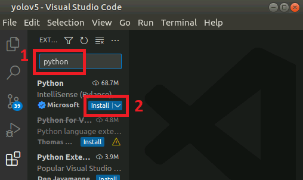

## Educational objectives

The objective of these practical sessions is to touch on all the stages of *deep learning* engineering, namely:
- data **acquisition** and **labelling**, 
- convolutional neural networks **training**, 
- performance **evaluation** of the learned task,
- **visualization** of the obtained results.

For this, our starting point will be the object detector widely known and used by the scientific and industrial communities: [YOLO](https://arxiv.org/pdf/1506.02640.pdf) (You Only Look Once). We will work with [version 5](https://github.com/ultralytics/yolov5) released in 2020. 

> At the end of the course, you will know how to use YOLOv5, how to train it on your own data, and how to evaluate it. 

## How the sessions go

>**One for all, all for one!**
>
>Because there is strength in numbers, and joy and good humor facilitate learning -- of humans -- the practical sessions will take place in a context that is both collective and individual, not always at the workstations, and always in the interest of understanding. We will all have a role to play, at each step.

We are going to train YOLOv5 to detect several classes of objects, at the rate of one class of object per pair. The *dataset* that we will build for this will be common to both groups running in parallel (*e.g.*, groups A1 \& A2, groups B1 \& B2).

To do this, we will go through several steps:

* :fire: <mark>**step 1 - acquisition**</mark>: each binomial will take several video sequences of the class of objects they have chosen from a proposed list, and put it on a common data server for groups A1/A2 and B1/B2 ;
* :fire: <mark>**step 2 - annotation**</mark>: with the CVAT tool, each binomial will annotate its own image sequences with the chosen object class, so that at the end of the annotation phase, the whole group will have collectively built a multi-class dataset that everyone will benefit from to do their learning;
* :fire: <mark>**step 3 - getting to grips with the YOLOv5 code**</mark>: at the end of this step, you will know how to apply a pre-trained YOLOv5-S model on COCO to your own images, enter the architecture of the network and identify its different layers and their dimensions, visualize the resulting detection output, etc. To achieve this, a game of "where is Charlie?" will be proposed to you and will push you to deconstruct the execution of the code step by step. For instance, you will have to answer questions like "what is the size of the tensor at the output of layer 17 for an input image of 512x512x3?";
* :fire: <mark>**step 4 - training YOLOv5 on our dataset**</mark>: the ideal way to analyze the performance of a given set of parameters (input image resolution, network size, batch size, etc.) is to run as many trainings as possible configurations and then compare them to select the best one. We can then display on the same graph different sizes of models, for different resolutions, and compare their speed of execution to the *mean average precision* that they achieve on a given dataset, for example :

<center>


*Source: https://github.com/ultralytics/yolov5*

</center>

>A learning process takes several hours. To be able to compare all these configurations, you need either to have several powerful GPU servers that can run several configurations in parallel, or to have a lot of time and be patient... 
>
>**Also, a training session consumes energy.**
>
>It is therefore not possible for each pair to run a training session for each set of parameters and then do a comparative analysis of the results. 
>
>**But, once again, there is strength in numbers.**
>
>Each pair will therefore position itself on a given configuration and will launch the associated training on the dataset of the group.

* :fire: <mark>**step 5 - performance analysis**</mark>: once all the training is done, each pair will be able to evaluate the performance of its own configuration, analyze the results quantitatively, *i.e.*, with numbers, and qualitatively, *i.e.*, with an "eye" visualization of the error cases and the cases that work. A comparative evaluation will also be possible, since everyone will have access to the results obtained by the other pairs, through a common *leaderboard*.

## Evaluation methods

Each pair will produce a video clip of about 5~10 minutes. Of course, the relevance of the content is more important than the length of the clip, so you are free to decide how much time you need to cover, for instance:
* the statistics of your acquisitions (the chosen class, the different acquisition contexts, the number of annotated images, the annotation strategy, time spent, encountered difficulties...) ;
* quantitative analysis of your results (performance metrics, number of epochs to converge, speed of execution of the model, distribution of performance over the different classes of objects, potential *overfitting*, comparison of the metrics to other configurations and interpretation of this comparison...);
* qualitative analysis of your results (visualization of the model execution, performance according to the acquisition context, according to the quality of the annotation...);
* other ideas you might have.

You will have understood that the evaluation of your work will not depend on the performance of your model training (and thus on the configuration that will have been assigned to you), but rather on the analysis that you will be able to do.

## Session tools and workspace configuration

### Shared file 2022-2023

So that everyone has the information of which pair is working on which class and which YOLO configuration, a :fire::page_with_curl: [shared file is available](https://docs.google.com/spreadsheets/d/1smyGWTv-3chS242o51kwthJtzzOhafJqURbdl5zbyNE/edit?usp=sharing) :page_with_curl::fire:. Sharing is subject to validation, you will have to wait until you have been authorized before you can modify the document.

>The videos below guide you in filling this document. 
>
>For confidentiality reasons, the names used are fictitious.

***Let's go*** :
___________________

* :fire::computer: <mark>***étape 1*</mark> : configuring work pairs**
___________________

* :fire::computer: <mark>***étape 2*</mark> : object classes choice**
___________________

* :fire::computer: <mark>***étape 3*</mark> : YOLOv5 configuration choice**
___________________


### IDE and YOLOv5 clone

This section guides you through the configuration of your workspace with the tools you have in the lab. The proposed configuration is based on an Ubuntu 20.04 environment, with VS Code as an IDE and the creation of a virtual environment using `python venv`.
You are of course free to use any IDE if you have other preferences, or to use Anaconda to create your virtual environment... the main thing is that it works !

***Let's go*** :
___________________

* :fire::computer: <mark>***step 1*</mark>: setting up the tree**

  ```sh
  ## Cloning the Github repository of yolov5 release 6.2
  login@machine:~$ cd <path/to/workspace>
  login@machine:<path/to/workspace>$ git clone -b v6.2 https://github.com/ultralytics/yolov5.git
  login@machine:<path/to/workspace>$ cd yolov5

  ## Configuration of the virtual environment named 'yolov5env'
  login@machine:<path/to/workspace>/yolov5$ python3 -m venv yolov5env # Creation
  login@machine:<path/to/workspace>/yolov5$ source yolov5env/bin/activate # Activation
  (yolov5env) login@machine:<path/to/workspace>/yolov5$ python3 -m pip install --upgrade pip # Upgrade pip
  (yolov5env) login@machine:<path/to/workspace>/yolov5$ pip3 install -r requirements.txt # Install libs
  ```
  *At this point, the whole YOLOv5 tree is in place, all the libraries are installed.*
___________________

* :fire::computer: <mark>***step 2*</mark>: VS Code configuration**
  
  In VS Code, open the `yolov5` folder from the previous step :

  <center>

  

  </center>

  Next, make sure that the extension for Python is installed. To do this, go to the "Extensions" tab *via* the `Ctrl + Shift + X` shortcut and search for `python`. Install the extension if it is not already installed:

  <center>

  

  </center>

  Next, select the Python interpreter for the virtual environment you created in step 1, using the shortcut `Ctrl + Shift + P` to bring up the command palette, then typing the command `Python: Select Interpreter`. From the choices offered, click on the one corresponding to the virtual environment `yolov5env` :

  <center>

  

  </center>
___________________

* :fire::computer: <mark>***step 3*</mark>: let's see if you followed...**

  If everything is set up correctly, you can launch a terminal in VS Code *via* `Terminal > New Terminal` and type the following command:

  ```sh
  (yolov5env) login@machine:<path/to/yolov5>$ python detect.py --source 'https://ultralytics.com/images/zidane.jpg'
  ```

  Once the command is executed, you will find the result of the YOLOv5-S model execution on the `zidane.jpg` image under the `runs/detect/exp` folder:

  <center>

  

  </center>
___________________

:fire::fireworks::thumbsup::star2: **Well done !**

### CVAT for annotation

### Data server for the dataset

## Session schedule

<center>

| Group 	|                                       Dates                                      	|             Rooms             	|    Supervisor     	|
|:------:	|:--------------------------------------------------------------------------------:	|:-----------------------------:	|:------------------:	|
|   A1   	| 30/11/2022 \ 12h30 - 15h15 <br /> 07/12/2022 \ 09h30 - 12h15 <br /> 14/12/2022 \ 15h30 - 18h15 	| GEI-111-A <br /> GEI-109-A <br /> GEI-111-A 	| Claire LABIT-BONIS 	|
|   A2   	| 30/11/2022 \ 12h30 - 15h15 <br /> 07/12/2022 \ 09h30 - 12h15 <br /> 14/12/2022 \ 15h30 - 18h15 	| GEI-111-B <br /> GEI-109-B <br /> GEI-111-B 	| Smail AIT BOUHSAIN 	|
|   B1   	| 30/11/2022 \ 15h30 - 18h15 <br /> 07/12/2022 \ 15h30 - 18h15 <br /> 14/12/2022 \ 09h30 - 12h15 	| GEI-111-A <br /> GEI-111-A <br /> GEI-109-A 	| Claire LABIT-BONIS 	|
|   B2   	| 30/11/2022 \ 15h30 - 18h15 <br /> 07/12/2022 \ 15h30 - 18h15 <br /> 14/12/2022 \ 09h30 - 12h15 	| GEI-111-B <br /> GEI-111-B <br /> GEI-109-B 	|    Pierre MARIGO   	|

</center>
