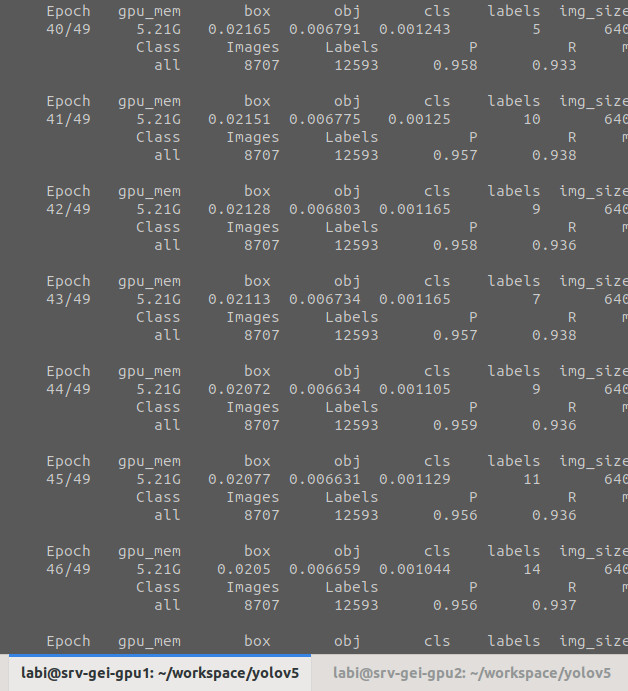
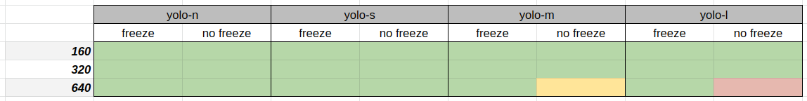
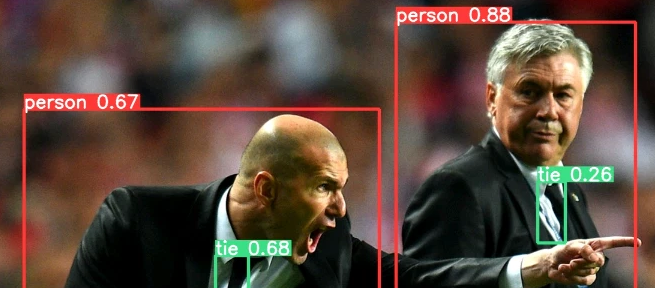

## **Previously on "DLCV Practical sessions"...**

 <center>


 </center>

## Il est beau le *dataset*

### Répartition des classes
Grâce à nous tou·te·s, on a construit un beau *dataset* qui nous permet de détecter plein de classes d'objets très utiles. 
Le tableau ci-dessous indique le nombre d'images et la répartition des différentes classes entre les ensembles de *train*, *validation* et *test* :

 <center>


 </center>

### Analyse des labels
La quantité de labels par image et leur forme varie en fonction des classes annotées. Par exemple, les images de `lentilles` contiennent beaucoup plus d'instances que la classe `lunettes`, pour un nombre équivalent d'images. Par ailleurs, les objets sont majoritairement centrés dans l'image même si toutes les positions sont représentées. Leur taille quant à elle diffère d'une classe à l'autre, bien que les classes `lentilles` et `bague` génèrent un point chaud dans le coin en bas à gauche, correspondant aux objets de petite taille.

  <center>


 </center>


## :ninja: Une semaine pour tout changer :ninja:

### Ce que vous n'avez pas vu... 
<center>

</center>

* <mark>**encore plus de *data processing***</mark> : après l'*upload* de toutes vos données sur le serveur la semaine dernière, il a fallu les homogénéiser. Certains fichiers contenaient des espaces en trop, les *splits* n'étaient pas toujours formatés de la même manière, l'arborescence était parfois à réorganiser, *etc*. 
* <mark>***get ready for training***</mark> : une fois le *dataset* formaté, il faut préparer YOLO pour l'apprentissage, et notamment écrire le fichier de configuration qui va bien pour un apprentissage sur des données *custom* :

<center>

</center>

&nbsp;

* <mark>**la lente agonie des GPUs**</mark> : à l'heure où j'écris ces lignes (14 décembre à ~minuit), nous en sommes à 44 heures d'apprentissage, réparties sur les 8 GPUs des serveurs 1 et 2 de l'INSA, et chaque GPU a 8Go de mémoire :

<center>



</center>
&nbsp;

<center>


</center>
&nbsp;

* <mark>**raté, on recommence -- ou "ce qui était prévu mais qui n'a pas marché"**</mark> : le VPN se déconnecte, la connexion SSH se ferme et arrête une liste d'apprentissages fièrement lancés pour tourner toute la nuit (on t'avait pourtant prévenue de faire un `nohup` ou d'utiliser `tmux`) ; les classes ne sont pas les bonnes, le *batch* est trop gros et explose la mémoire, le *batch* est trop petit et explose le temps, le réseau est trop lourd et fait exploser CUDA.


### Configurations entrainées
Les apprentissages faits ces derniers jours couvrent les configurations suivantes (en vert ce qui est fait, en jaune ce qui est en cours, en rouge ce qu'il reste à faire) : 

<center>

</center>
&nbsp;

Il était prévu de travailler avec différentes tailles de *batch*, en l'occurrence 1 et 32. Finalement, un *batch* de 1 prend beaucoup trop de temps ; toutes les configurations ont été entrainées avec un *batch* de 64, voire de 96.

[Quatre versions](https://github.com/ultralytics/yolov5#pretrained-checkpoints) de YOLO ont finalement été testées, avec de la plus petite à la plus grande : `n`, `s`, `m`, et `l`. Le détail de ces architectures est visible soit dans Tensorboard en visualisant le graphe d'une configuration correspondant à la version choisie, soit directement dans les fichiers `.yaml` du dossier `models` dans le *workspace* yolov5.

#### *Transfer learning, fine-tuning, pre-trained models...*
`freeze` veut dire qu'en début d'apprentissage, les poids sont initialisés avec un modèle pré-entrainé sur le *dataset* COCO, et que les poids de certaines courches ne sont pas mis à jour pendant l'apprentissage. Dans notre cas, on *freeze* le *backbone*. On "transfère" également la tâche apprise par le réseau pré-entrainé vers une nouvelle tâche, en changeant le nombre et le type des classes à prédire dans notre cas. On dit également qu'on "affine" l'extraction des caractéristiques pré-entrainée en mettant à jour tout ou partie des poids pendant l'apprentissage.


## :fire: *And now, what?* :fire:

On va de nouveau tirer au sort les configurations sur lesquelles vous vous positionnerez, puisque rien ne s'est passé comme prévu pendant les apprentissages. Mais on est agiles, on s'adapte. Le plan sera ensuite le suivant :

* vous mettrez en place votre *workspace*, à savoir : le clone de yolov5 dans votre *home directory*, ouvert dans VS Code avec un accès en SSH au serveur GPU `srv-gei-gpu1` grâce à l'extension "Remote SSH" (`Ctrl+Shitf+X` pour ouvrir le gestionnaire d'extensions), ainsi que l'activation de l'environnement virtuel qui va bien -- cf. partie "configuration du *workspace*" ;
* vous pouvez lancer un `tensorboard --logdir=/scratch/labi/DLCV/train` pour visualiser et comparer les différents apprentissages réalisés ;
* vous pouvez également ouvrir *via* VS Code en SSH le dossier `/scratch/labi/DLCV/train` en question, et ainsi accéder à tous les graphiques de performance générés par YOLO pour chaque configuration d'apprentissage (matrices de confusion, courbes de précision-rappel, F1-score *vs.* score de confiance, *etc*.) ;
* pour évaluer plus en détails votre configuration (notamment sur la base de test), il vous faudra copier le fichier `/scratch/labi/DLCV/dataset/dlcv.yaml` dans votre dossier `path/to/yolov5/data/` puis appeler le script `val.py` avec les paramètres qui vous intéressent. Plusieurs tâches d'évaluations sont possibles : `train`, `val`, `test`, `speed`, `study`. Par exemple, l'évaluation sur base de test pour la configuration ;
* évaluez également les modèles de manière qualitative, c'est-à-dire en visualisant directement les résultats, "à l'oeil". Pour cela, lancez `detect.py` sur une nouvelle vidéo par exemple (pas besoin d'extraire les *frames*, le script prend aussi des vidéos `.mp4` en entrée). Le résultat est stocké dans `path/to/yolo/runs/detect/exp_name`. Vous pouvez changer `exp_name` avec l'option `--name` (plus pratique pour s'y retrouver que d'avoir `exp1`, `exp2`, `exp3`...) 


Ne partez pas ! Vous vous souvenez des quêtes annexes du Bingo de YOLO ? Je vous les remets en mémoire juste au cas où... parce que maintenant que tout roule, vous pouvez lancer la détection avec des poids COCO, faire du pas à pas en mode *debug* pour aller chercher la valeur du poids, visualiser la *data augmentation* faite quand on lance `train.py`, *etc*.

<center>

</center>

## **Annexe** : configuration du *workspace*

Cette section vous guide dans la configuration de votre *workspace* avec les outils dont vous disposez en salle de TP. La configuration proposée se base sur un environnement Ubuntu 20.04, avec l'IDE VSCode et la création d'un environnement virtuel à l'aide de `python venv`.
Vous êtes évidemment libres d'utiliser n'importe quel IDE si vous avez d'autres préférences, ou d'utiliser Anaconda pour créer votre environnement virtuel... le principal étant que ça marche !

***Let's go*** :
___________________


* :fire::computer: <mark>***étape 1*</mark> : clone de YOLOv5**

  ```sh
  ## Clonage du dépôt Github de la release 6.2 de yolov5 dans votre home directory
  login@machine:~$ cd <path/to/workspace>
  login@machine:<path/to/workspace>$ git clone -b v6.2 https://github.com/ultralytics/yolov5.git
  login@machine:<path/to/workspace>$ cd yolov5
  ```


* :fire::computer: <mark>***étape 2*</mark> : ouvrez une session SSH dans VSCode pour vous connecter à srv-gei-gpu1**
  
  Pour cela, il vous faut d'abord installer l'extension `Remote SSH` *via* le gestionnaire d'extensions (raccourci Ctrl+Shift+X). Ensuite, tout en bas à gauche vous pouvez ouvrir une session SSH et vous placer dans le dossier YOLOv5, en cliquant sur l'icône avec deux flèches.

* :fire::computer: <mark>***étape 3*</mark> : configuration de l'environnement virtuel**

  Ouvrez un nouveau terminal dans VS Code puis créez l'environnement virtuel qui va bien : 
  ```sh
  ## Configuration de l'environnement virtuel nommé 'yolov5env'
  login@machine:<path/to/workspace>/yolov5$ python3 -m venv yolov5env # Création
  login@machine:<path/to/workspace>/yolov5$ source yolov5env/bin/activate # Activation
  (yolov5env) login@machine:<path/to/workspace>/yolov5$ python3 -m pip install --upgrade pip # Mise à jour de pip
  (yolov5env) login@machine:<path/to/workspace>/yolov5$ pip3 install -r requirements.txt # Install libs
  ```
  *A ce stade, toute l'arborescence de YOLOv5 est en place, toutes les librairies sont installées.*
___________________

* :fire::computer: <mark>***étape 4*</mark> : configuration de VS Code**

  Assurez-vous ensuite que l'extension pour Python est bien installée. Pour cela, accédez à l'onglet "Extensions" *via* le raccourci `Ctrl + Shift + X` et cherchez `python`. Installez l'extension si elle ne l'est pas déjà :

  <center>

  

  </center>

  Sélectionnez ensuite l'interpréteur Python de l'environnement virtuel que vous avez créé à l'étape 1, en utilisant le raccourci `Ctrl + Shift + P` pour faire apparaître la palette de commande, puis en tapant la commande `Python: Select Interpreter`. Parmi les choix proposés, cliquez sur celui correspondant à l'environnement virtuel `yolov5env` :

  <center>

  

  </center>
___________________

* :fire::computer: <mark>***étape 5*</mark> : voyons si vous avez suivi...**

  Si tout est correctement configuré, vous pouvez lancer un terminal dans VS Code *via* `Terminal > New Terminal` et taper la commande suivante :

  ```sh
  (yolov5env) login@machine:<path/to/yolov5>$ python detect.py --source 'https://ultralytics.com/images/zidane.jpg'
  ```

  Une fois la commande exécutée, vous retrouvez le résultat de l'éxecution du modèle YOLOv5-S sur l'image `zidane.jpg` dans le dossier `runs/detect/exp` :

  <center>

  

  </center>

___________________

:fire::fireworks::thumbsup::star2: **Well done !**