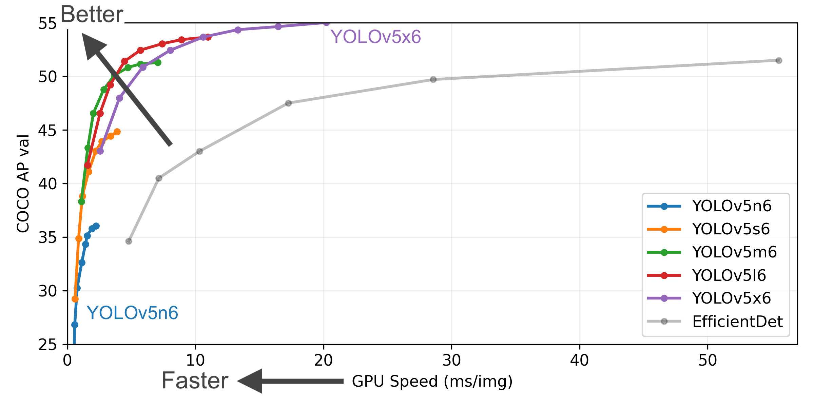
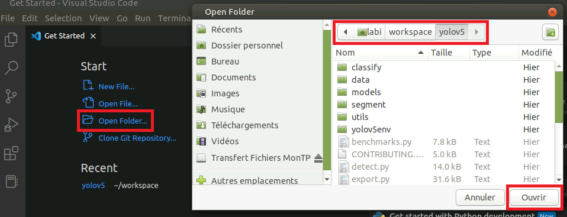
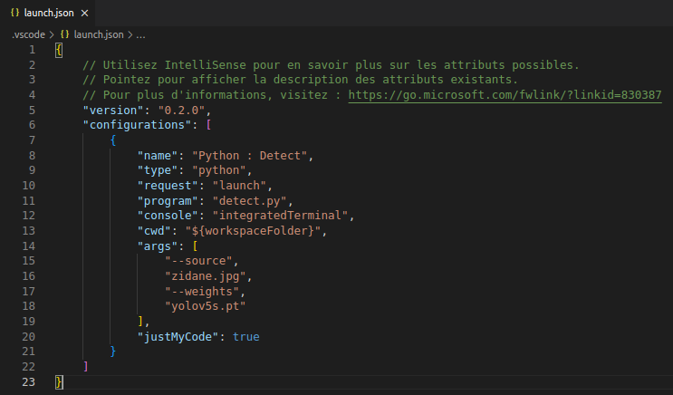


:man_dancing: Eeeeet zééé bartiiii pour la deuxième édition du cours de Deep Learning en 5-SDBD. L'année dernière a été un franc succès, alors j'ai hâte qu'on s'y remette cette année :smile:


## Objectifs pédagogiques

L'objectif de ces séances de travaux pratiques est de toucher à toutes les étapes de l'ingénierie du *deep learning*, à savoir :
- l'**acquisition** et l'**annotation** de données, 
- l'**apprentissage** de réseaux de convolution, 
- l'**évaluation** des performances de la tâche apprise,
- la **visualisation** des résultats obtenus.

Pour cela, notre point de départ sera le détecteur d'objets très largement connu et utilisé par les communautés scientifique mais aussi industrielle : [YOLO](https://arxiv.org/pdf/1506.02640.pdf) (You Only Look Once). L'année dernière, nous avions utilisé la [version 5](https://github.com/ultralytics/yolov5) sortie en 2020. Cette année, nous nous attaquons à la [version 8](https://github.com/ultralytics/ultralytics) sortie en 2022. Tout va trop vite, YOLOv8 est déjà dépassé par [YOLO-NAS](https://github.com/Deci-AI/super-gradients/blob/master/YOLONAS.md), mais, eh, on peut pas être partout.

> A la fin des TPs, vous saurez comment utiliser YOLOv8, comment l'entrainer sur vos propres données, et comment l'évaluer. 

>L'année dernière, on nous a dit "les messages en bleu on croyait que ça servait à rien alors on les a pas lus". Je vais éviter les messages en bleu, donc.


## Déroulement des séances

**Un·e pour tou·te·s, tou·te·s pour un·e !**
Parce que l'union fait la force, que la joie et la bonne humeur facilitent l'apprentissage -- des humains --, les séances de travaux pratiques se dérouleront dans un contexte à la fois collectif et individuel, pas toujours sur les postes de travail, et toujours dans l'intérêt de la compréhension. Nous aurons tou·te·s un rôle à jouer, à chacune des étapes.

Nous allons entrainer YOLOv8 à détecter plusieurs classes d'objets, à raison d'une classe d'objet par binôme. Le *dataset* que nous allons construire pour cela sera commun aux trois groupes de TPs qui se déroulent en parallèle et/ou en différé selon les problématiques d'emploi du temps, de disponibilité de salle, d'organisation. Bref, trois groupes. Même *dataset*.

Pour cela, nous passerons par plusieurs étapes :

* :fire: <mark>**étape 1 - acquisition**</mark> : chaque binôme prendra plusieurs séquences vidéo de la classe d'objets qu'il aura choisie parmi une liste proposée, et la mettra sur un serveur de données commun à tous les groupes ;
* :fire: <mark>**étape 2 - annotation**</mark> : avec l'outil CVAT, chaque binôme annotera ses propres séquences d'images avec la classe d'objet choisie, de sorte qu'à la fin de la phase d'annotation, le groupe entier de TP aura collectivement construit un *dataset* multi-classes dont tout le monde bénéficiera pour faire ses apprentissages ;
* :fire: <mark>**étape 3 - prise en main du code de YOLOv8**</mark> : à la fin de cette étape, vous saurez appliquer sur vos propres images un modèle YOLOv8-S pré-entrainé sur COCO, entrer dans l'architecture du réseau, visualiser les *feature maps*, etc. 
* :fire: <mark>**étape 4 - apprentissage de YOLOv8 sur notre *dataset***</mark> : l'idéal pour analyser les performances d'un jeu de paramètres donné (résolution des images d'entrée, taille du réseau, taille de *batch*, etc.) est de lancer autant d'apprentissages que de configurations possibles et de les comparer ensuite pour sélectionner celle qui est la meilleure. On peut ensuite afficher sur un même graphe différentes tailles de modèles, pour différentes résolutions, et comparer leur rapidité d'exécution à la *mean average precision* qu'ils réalisent sur un *dataset* donné, par exemple :

<center>


*Source : https://github.com/ultralytics/yolov5*

</center>

* :fire: <mark>**étape 5 - analyse des performances**</mark> : une fois tous les apprentissages faits, chaque binôme pourra évaluer les performances de sa propre configuration, analyser les résultats de manière quantitative, *i.e.*, avec des chiffres, et de manière qualitative, *i.e.*, avec une visualisation "à l'oeil" des cas d'erreur et des cas qui fonctionnent. Une évaluation comparative sera également réalisable, puisque tout le monde aura accès à toutes les configurations entrainées.


**Un apprentissage dure plusieurs heures.** 
Pour pouvoir comparer toutes ces configurations, il faut soit disposer de plusieurs serveurs GPU puissants qui peuvent faire tourner en parallèle plusieurs configurations, soit disposer de beaucoup de temps et être patient... 

**Un apprentissage consomme de l'énergie.**
Il n'est donc pas envisageable que chaque binôme lance un apprentissage pour chaque jeu de paramètres puis fasse une analyse comparative des résultats. 

**MAIS ! On peut rendre le problème moins complexe.**
Nous vous fournirons un sous-ensemble du *dataset* pour que vous puissiez apprendre à manipuler une base d'apprentissage, de validation et de test. Vous pourrez lancer un mini-apprentissage en local sur CPU pour quelques *epochs*.

Pour l'évaluation des résultats, chaque binôme se positionnera sur une configuration tirée au sort (résolution d'image/taille de réseau/poids figés ou non) et pourra analyser sa configuration et les performances de sa classe d'objets par rapport aux autres configurations et autres classes d'objets.


## Modalités d'évaluation


La **deadline** est fixée au 12 janvier 2024 à 20h. Vous devez déposer [sur Moodle](https://moodle.insa-toulouse.fr/course/view.php?id=1154&section=4) :
* votre capsule vidéo au format `.mp4` ;
* un fichier `.pdf` avec vos réponses aux quêtes annexes.

Les deux fichiers additionnés ne doivent pas dépasser 256Mo.


### Capsule vidéo
Chaque binôme produira une capsule vidéo (c'est-à-dire une séquence vidéo) d'environ 10 minutes. Bien sûr, la pertinence du contenu importe plus que la longueur de la capsule, même si la consigne de temps est à respecter. 

> Si les 256 Mo sont trop difficiles à atteindre, donnez-nous un lien [Youtube vers votre vidéo par exemple](https://youtu.be/eBGIQ7ZuuiU). Ou Drive. Ou autre. On est à l'ère du numérique, on trouvera une solution.

Le tableau d'analyse ci-dessous peut vous aider à structurer votre analyse et vous donne une idée des points qui seront évalués :

<center>


</center>

Globalement, on aura :
* les <mark>trois grandes thématiques</mark> vues en cours et en TP peuvent donner lieu à analyse : 
  * le ***dataset*** (acquisition, annotation), 
  * l'**apprentissage**, 
  * et l'**inférence** (= la détection appliquée à des données inconnues ou de test avec le modèle entrainé) ;
* <mark>trois types d'analyse</mark> possibles :
  * l'**analyse quantitative** qui consiste à analyser la répartition des classes, le nombre d'instances annotées, présenter des chiffres, interpréter des courbes de résultats, des temps d'exécution du réseau en fonction de sa taille, de la résolution image, commenter les métriques de performance en fonction du *split*, de la classe, etc.,
  * l'**analyse qualitative** qui consiste à analyser visuellement les performances d'une configuration de réseau donnée, par exemple se rendre compte que les petits réseaux ont plus de mal à détecter les petits objets, que la classe `velo` l'année dernière était mieux détectée quand le vélo prenait toute l'image (faire le lien avec l'annotation qui a été faite), ou que les petits objets circulaires et orangés étaient souvent détectés comme des lentilles (exemple : oeil de pigeon...),
  * le **retour d'expérience** : je vous demande votre avis ! Comment vous êtes-vous réparti l'annotation dans le binôme ? Entre différents binômes qui ont annoté la même classe ? Quelles difficultés avez-vous rencontrées ? Quelles questions vous êtes-vous posées au moment de l'acquisition ? Que feriez-vous différemment ? Quelle a été votre stratégie pour choisir vos exemples d'inférence ? Comment avez-vous décidé de la répartition entre les différents *splits* de *train*, *val* et *test* ? 
* <mark>deux niveaux d'analyse</mark> :
  * **micro** : vous pouvez analyser votre classe d'annotation (métriques de performance sur train/val/test, quantité annotée, type d'annotation, nombre d'instances par image, stratégie d'annotation, etc.), les performances fines de votre configuration de réseau* (temps d'exécution, taille du réseau, place mémoire, nombre de couches, de paramètres, analyse des courbes F1, PR, etc.),
  * **macro** : vous *vs.* la promo entière et les autres configurations. Par exemple, une analyse plus globale qui compare les différentes courbes F1 des différents apprentissages -- quelle est l'influence de la taille du réseau ? Quelle configuration converge le mieux ? Le plus rapidement ? Laquelle gère mieux les petits objets ? Quelle classe se distingue des autres et pourquoi ? Quelle a été la dynamique de groupe globalement ? Quelles discussions avez-vous eues avec les autres binômes pour vous accorder sur une stratégie d'annotation ? 
  
*celle tirée au sort en TP -- si elle était trop mauvaise, prenez-en une autre, pas grave, il faut pouvoir en dire quelque chose d'autre que "c'est nul et ça marche pas"... 


Il y a **des millions de choses** à dire et tout n'est pas applicable à toutes les classes d'objets, toutes les configurations ni tous les binômes. Etre exhaustif vous demanderait une analyse allant de 45 minutes à 2 jours (rien que ça). Soyez synthétiques et pertinents. Ce n'est pas une tâche simple, mais il y a de la matière à votre disposition.

 **Pas de contrainte sur le format** : une vidéo d'un PPT qui défile, une superproduction *full* 3D pour concurrencer Avatar 2 (à condition d'avoir aussi un meilleur scénario...). L'important est d'avoir un contenu pertinent, et que ça ne soit pas la corvée du siècle pour vous. Amusez-vous, vendez-nous une analyse de rêve ;


<!--
### Quêtes annexes

Le plus pratique pour répondre à ces quêtes annexes est de noter vos réponses dans un rapport, d'où la contrainte donnée plus haut d'un `.pdf` déposé sur Moodle. 

Je vous laisse aller voir [ici](http://clairelabitbonis.github.io/fr/posts/teaching/deep_learning_for_cv/practical_sessions_dlcv/02_yolo/#qu%C3%AAtes-annexes) pour le contenu des quêtes annexes.

Les quêtes annexes sont annexes, mais elles vous apporteront du bonus si vous les faites. Rappelez-vous : Far Cry, Assassin's Creed, tout ça tout ça.

 ## Outils et configuration du *workspace*

### IDE et clone de YOLOv5 -- si vous voulez être en local sur vos machines (CPU *only*)

Cette section vous guide dans la configuration de votre *workspace* avec les outils dont vous disposez en salle de TP. La configuration proposée se base sur un environnement Ubuntu 20.04, avec l'IDE VSCode et la création d'un environnement virtuel à l'aide de `python venv`.
Vous êtes évidemment libres d'utiliser n'importe quel IDE si vous avez d'autres préférences, ou d'utiliser Anaconda pour créer votre environnement virtuel... le principal étant que ça marche !

***Let's go*** :
___________________

* :fire::computer: <mark>***étape 1*</mark> : mise en place de l'arborescence**

  ```sh
  ## Clonage du dépôt Github de la release 6.2 de yolov5
  login@machine:~$ cd <path/to/workspace>
  login@machine:<path/to/workspace>$ git clone -b v6.2 https://github.com/ultralytics/yolov5.git
  login@machine:<path/to/workspace>$ cd yolov5

  ## Configuration de l'environnement virtuel nommé 'yolov5env'
  login@machine:<path/to/workspace>/yolov5$ python3 -m venv yolov5env # Création
  login@machine:<path/to/workspace>/yolov5$ source yolov5env/bin/activate # Activation
  (yolov5env) login@machine:<path/to/workspace>/yolov5$ python3 -m pip install --upgrade pip # Mise à jour de pip
  (yolov5env) login@machine:<path/to/workspace>/yolov5$ pip3 install -r requirements.txt # Install libs
  ```
  *A ce stade, toute l'arborescence de YOLOv5 est en place, toutes les librairies sont installées.*
___________________

* :fire::computer: <mark>***étape 2*</mark> : configuration de VS Code**
  
  Dans VS Code, ouvrez le dossier `yolov5` de l'étape précédente :

  <center>

  

  </center>

  Assurez-vous ensuite que l'extension pour Python est bien installée. Pour cela, accédez à l'onglet "Extensions" *via* le raccourci `Ctrl + Shift + X` et cherchez `python`. Installez l'extension si elle ne l'est pas déjà :

  <center>

  

  </center>

  Sélectionnez ensuite l'interpréteur Python de l'environnement virtuel que vous avez créé à l'étape 1, en utilisant le raccourci `Ctrl + Shift + P` pour faire apparaître la palette de commande, puis en tapant la commande `Python: Select Interpreter`. Parmi les choix proposés, cliquez sur celui correspondant à l'environnement virtuel `yolov5env` :

  <center>

  

  </center>
___________________

* :fire::computer: <mark>***étape 3*</mark> : voyons si vous avez suivi...**

  Si tout est correctement configuré, vous pouvez lancer un terminal dans VS Code *via* `Terminal > New Terminal` et taper la commande suivante :

  ```sh
  (yolov5env) login@machine:<path/to/yolov5>$ python detect.py --source 'https://ultralytics.com/images/zidane.jpg'
  ```

  Une fois la commande exécutée, vous retrouvez le résultat de l'éxecution du modèle YOLOv5-S sur l'image `zidane.jpg` dans le dossier `runs/detect/exp` :

  <center>

  

  </center>

___________________

:fire::fireworks::thumbsup::star2: **Well done !**

### IDE et clone de YOLOv5 -- pour tourner sur le serveur GPU

Une fois connecté en SSH au serveur GPU, activez l'environnement virtuel créé par Pierre :

  ```sh
  login@serveur-gpu:~$ cd <path/to/workspace>/yolov5
  (env) login@serveur-gpu:<path/to/workspace>/yolov5$ source /scratch/marigo/venv/bin/activate
  ``` 
### Lancer le code en mode *debug*
Dans l'onglet *debug*, cliquez sur "créer un fichier launch.json". Vous pouvez ensuite configurer le `.json` comme ci-dessous, et adapter les paramètres d'appel :



Vous pouvez ensuite ajouter une configuration pour le *debug* du fichier `train.py` par exemple.


### CVAT pour l'annotation

### Serveur de données pour le *dataset* -->

## Planning des séances

<center>

| Groupe 	|                                       Dates                                      	|             Salles             	|    Intervenant·e   	|
|:------:	|:--------------------------------------------------------------------------------:	|:-----------------------------:	|:------------------:	|
|   A1   	| 30/11/2022 \ 12h30 - 15h15 <br /> 07/12/2022 \ 09h30 - 12h15 <br /> 14/12/2022 \ 15h30 - 18h15 	| GEI-111-A <br /> GEI-109-A <br /> GEI-111-A 	| Claire LABIT-BONIS 	|
|   A2   	| 30/11/2022 \ 12h30 - 15h15 <br /> 07/12/2022 \ 09h30 - 12h15 <br /> 14/12/2022 \ 15h30 - 18h15 	| GEI-111-B <br /> GEI-109-B <br /> GEI-111-B 	| Smail AIT BOUHSAIN 	|
|   B1   	| 30/11/2022 \ 15h30 - 18h15 <br /> 07/12/2022 \ 15h30 - 18h15 <br /> 14/12/2022 \ 09h30 - 12h15 	| GEI-111-A <br /> GEI-111-A <br /> GEI-109-A 	| Claire LABIT-BONIS 	|
|   B2   	| 30/11/2022 \ 15h30 - 18h15 <br /> 07/12/2022 \ 15h30 - 18h15 <br /> 14/12/2022 \ 09h30 - 12h15 	| GEI-111-B <br /> GEI-111-B <br /> GEI-109-B 	|    Pierre MARIGO   	|

</center>
