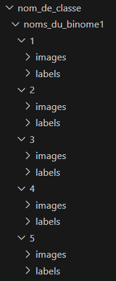
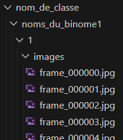
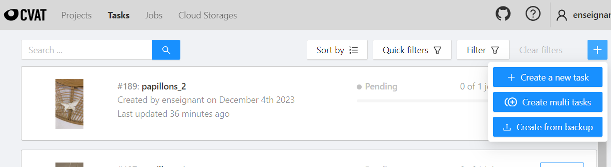
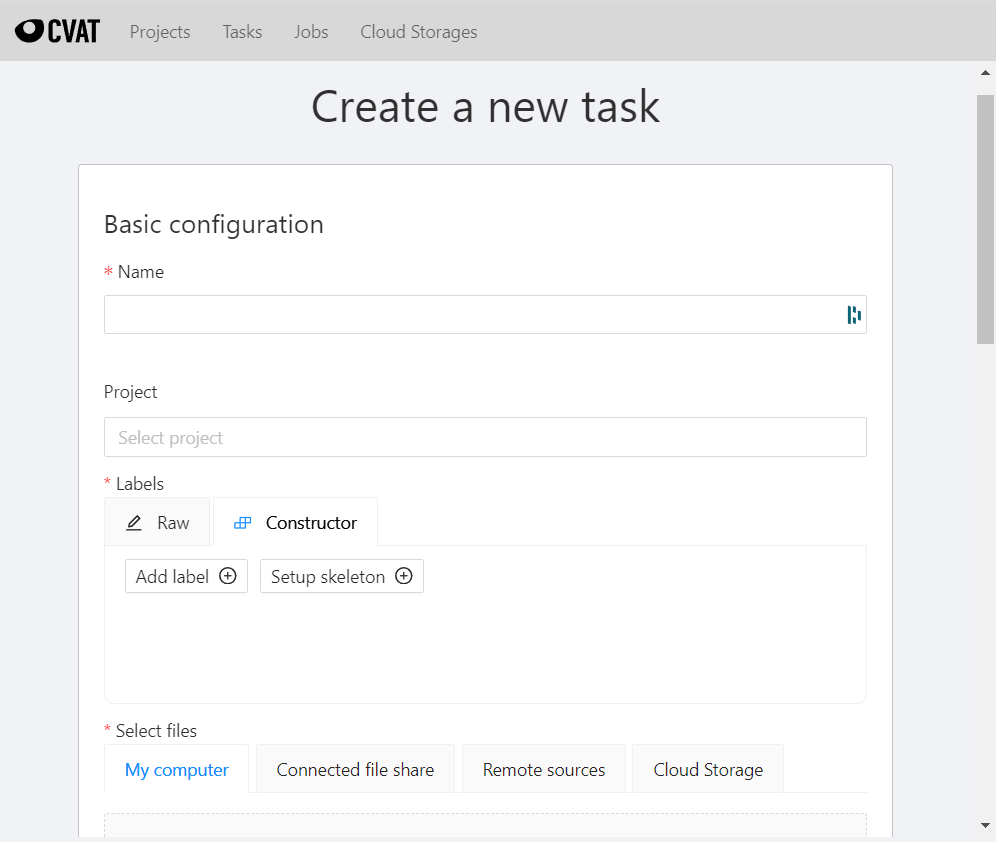
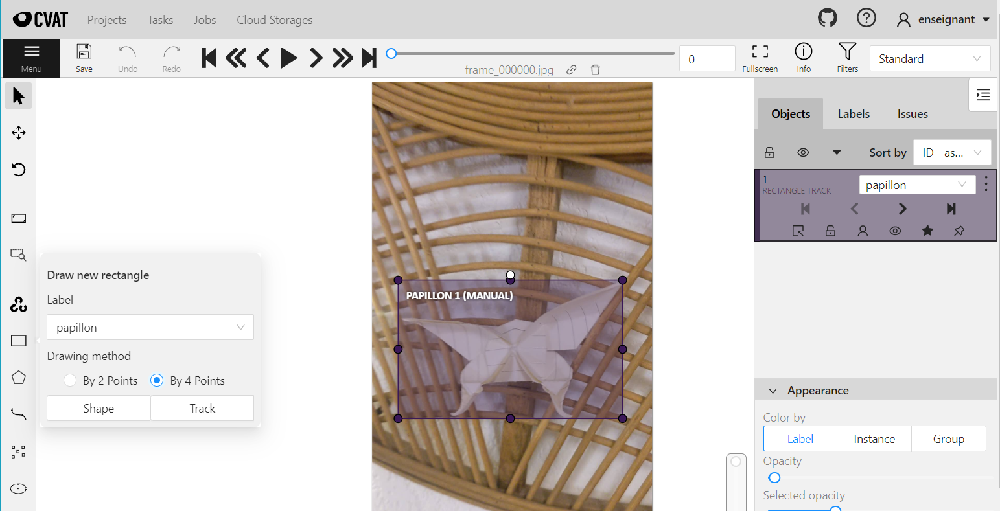
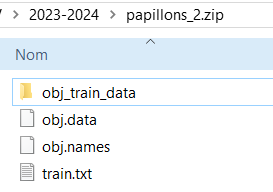
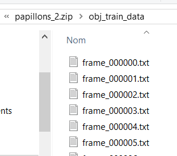
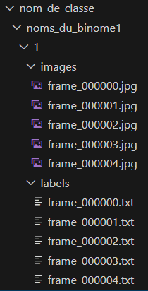
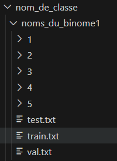


Tout ce dont vous avez besoin pour entrainer un détecteur d'objets est d'avoir des données qui représentent ces objets. Et de les nettoyer (les données, pas les objets). Et de les trier. Et de les annoter. Et d'en jeter un peu parce qu'elles sont pas si bien. Et d'en rajouter encore parce qu'il y en a plus assez. Etc. :+1: 



ATTENTION : vous devez avoir déposé vos données et votre *split* `train/val/test.txt` sur le serveur GPU avant la fin de la séance. On lancera l'ensemble des configurations d'apprentissage d'ici la semaine prochaine. Pas de données, pas d'apprentissage. Pas d'apprentissage, pas de TP. Pas de TP, pas de TP (les réfs à Mission Cléopâtre commencent à dater...).


## Acquisition

Prenez 5 vidéos de 10 secondes dans lesquelles se trouve la classe que vous voulez apprendre à détecter. 

Posez-vous des questions :
* est-ce que l'objet peut dépasser du cadre ?
* est-ce que j'ai suffisamment d'objets différents de la même classe ?
* est-ce que le contexte change entre les séquences ?
* etc.

Faites attention à ce que des objets appartenant aux classes des autres binômes ne se retrouvent pas dans vos séquences, sinon **_vous devrez les annoter aussi._**

Créez sur votre session une arborescence de fichiers comme la suivante :

<center>



</center>

...dans laquelle il faut :
* remplacer `nom_de_classe` par le nom de la classe que vous annotez ;
* remplacer `noms_du_binome1` par vos noms de famille ;
* les dossiers 1 à 5 correspondent aux séquences 1 à 5.

Une fois acquises, copiez les vidéos sur votre PC et extrayez-en les *frames* avec `ffmpeg` dans les différents dossiers `images` : 

  ```bash
  ffmpeg -i <video.mp4> -vf fps=30 -start_number 0 <nom_de_classe>/<noms_du_binome>/<num_sequence>/images/frame_%06d.jpg
  ```

Vous devez avoir une arborescence qui ressemble à ça à la fin :
<center>



</center>

## Import des données dans CVAT

C'est là que le travail commence... Connectez-vous avec vos identifiants INSA au serveur d'annotation [CVAT](https://cvat.ens.insa-toulouse.fr/).

Pour chaque séquence vidéo, créez une nouvelle tâche :
<center>



</center>

Renseignez le nom de la tâche (par exemple `<nom-classe>_<numero-sequence>`) et ajoutez le label de la classe que vous annotez :

<center>



</center>

Ajoutez ensuite (par *drag and drop*) toutes les `frame_XXXXXX.jpg` de la séquence en question et finissez par sélectionner le format d'annotation `YOLO 1.1` dans l'`Advanced Configuration`, avant de `Submit & Open`.

L'interface de labellisation s'ouvre.

## Labellisation

Dans la barre d'outils à gauche, pour créer une nouvelle annotation :
* sélectionnez `Draw new rectangle`, 
* la classe que vous voulez annoter, 
* `By 2 points` (il faudra cliquer les coins haut-gauche et bas-droite pour tracer un rectangle), 
* et `Track` (la *bounding box* sera propagée aux *frames* suivantes et gardera la même identité. Très pratique si vous ne voulez pas réannoter tous les objets à chaque *frame*...)

<center>



</center>

>**Cheatsheet :**
> * `F` : avance d'une *frame*
> * `D` : recule d'une *frame*
> * `V` : saute plusieurs *frames* en avant **et fait une interpolation linéaire pour propager les labels intermédiaires**
> * `C` : saute plusieurs *frames* en arrière **et fait une interpolation linéaire pour propager les labels intermédiaires**
> * `N` : crée une nouvelle annotation du même type que la précédente (`Track rectangle by 2 points` par exemple)

Les options disponibles pour chaque cible vous permettent de :
* les rendre visible/invisible (ça ne les supprime pas, c'est juste pour éviter de se faire gêner par des annotations existantes), 
* les indiquer comme "sorties du cadre",
* les marquer "occultées" quand une autre cible passe devant ou que l'objet passe derrière quelque chose (quand il est occulté, quoi),
* régler l'opacité de la boite, et d'autres attributs d'aspect.

## Export du *dataset*


Quand vous aurez fini d'annoter toutes vos séquences, dites-le nous. Nous devons ajouter vos tâches à un projet CVAT global qui contient toutes les classes d'objets, de manière à ce que quand vous exporterez vos labellisations, les numéros de classes soient bons. Sinon, par défaut ils sont tous à zéro. Et YOLO apprendra que la classe `papillons` et la classe `playmobil` sont la même chose puisqu'elles ont toutes les deux le numéro `0`.


Une fois qu'on vous donne le feu vert, vous pouvez exporter chacune de vos tâches (`Tasks > Actions > Export task dataset`). Choisissez le format `YOLO 1.1`, ne sauvegardez pas les images, donnez le nom que vous voulez à l'export et validez.

<center>




</center>

Vous obtenez un `.zip` qui contient un fichier `.txt` par image, dans `obj_train_data`. Vous pouvez copier ces fichiers dans le dossier `labels` de la séquence que vous venez d'exporter :

<center>



</center>

## Séparation train/val/test

On y est presque. Il ne reste plus qu'à séparer vos séquences en trois sous-ensembles qui serviront à l'apprentissage, à la validation et au test. Vous devez créer trois fichiers : `train.txt`, `val.txt` et `test.txt`. Dans chacun, vous mettrez la liste des chemins d'accès vers les images selon qu'elles doivent aller en base d'apprentissage, de validation ou de test. Par exemple, dans `train.txt` :

    ./velo/tic_et_tac/4/images/frame_000002.jpg
    ./velo/tic_et_tac/4/images/frame_000118.jpg
    ...
    ./velo/tic_et_tac/2/images/frame_000004.jpg
    ./velo/tic_et_tac/1/images/frame_000001.jpg
    ./velo/tic_et_tac/3/images/frame_000256.jpg


La répartition de vos données entre les différentes bases est une étape cruciale : 
* allez-vous mettre 3 séquences complètes en `train`, une en `val` et une en `test`, au risque d'avoir des exemples en test qui sont trop éloignés de ceux de la base d'apprentissage ? 
* ou bien allez-vous plutôt mettre les débuts de séquence en `train`, les milieux en `val`, les fins en `test`, mais dans ce cas vous biaiserez complètement l'apprentissage et obtiendrez des performances étrangement un peu trop hautes ? 
* vous pouvez aussi choisir la méthode bourrine et faire un random total sur la répartition...


Une fois votre répartition faite, sauvegardez les trois fichiers à la racine de votre dossier `<noms_binome>`, et copiez le tout avec :

  ```
  cd <nom_de_classe>/..
  scp <noms_du_binome> srv-gei-gpu2:/scratch/labi/DLCV/2023-2024/dataset/<nom_de_classe>/
  ```

<center>



</center>

Dernière chose : donnez-nous les droits sur les dossiers que vous créez. En vous connectant en SSH à `srv-gei-gpu2` et en faisant un `chmod -R 777` sur votre dossier dans `/scratch/labi/DLCV/2023-2024/dataset/<nom_de_classe>/`, par exemple.