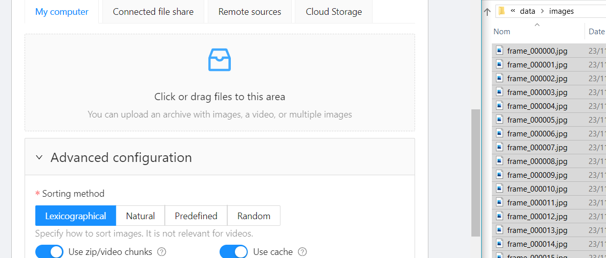
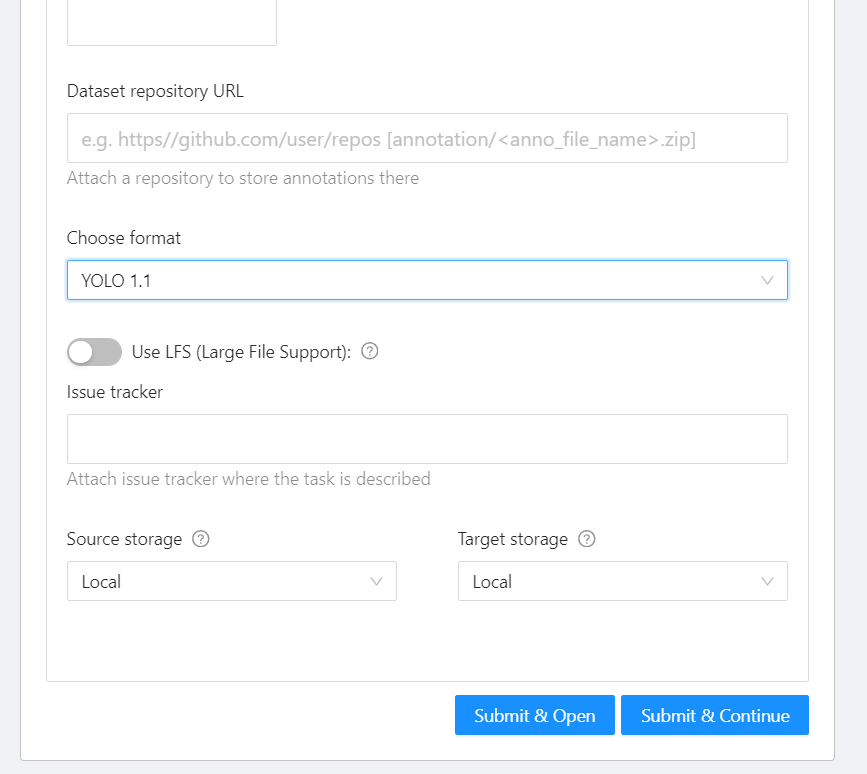


Tout ce dont vous avez besoin pour entrainer un détecteur d'objets est d'avoir des données qui représentent ces objets. Et de les nettoyer (les données, pas les objets). Et de les trier. Et de les annoter. Et d'en jeter un peu parce qu'elles sont pas si bien. Et d'en rajouter encore parce qu'il y en a plus assez. Etc. :+1: 


# Etape 1 : acquisition

Prenez 5 vidéos de 10 secondes dans lesquelles se trouve la classe que vous voulez apprendre à détecter. 

Posez-vous des questions :
* est-ce que l'objet peut dépasser du cadre ?
* est-ce que j'ai suffisamment d'objets différents de la même classe ?
* est-ce que le contexte change entre les séquences ?
* etc.


Faites attention à ce que des objets appartenant aux classes des autres binômes ne se retrouvent pas dans vos séquences, sinon **_vous devrez les annoter aussi._**


Créez sur votre session une arborescence de fichiers comme la suivante :

<center>


</center>

...dans laquelle il faut :
* remplacer `nom_de_classe` par le nom de la classe que vous annotez ;
* remplacer `noms_du_binome1` par vos noms de famille ;
* les dossiers 1 à 5 correspondent aux séquences 1 à 5.

Une fois acquises, copiez les vidéos sur votre PC et extrayez-en les *frames* avec `ffmpeg` dans les différents dossiers `images` : 

  ```bash
  ffmpeg -i <video.mp4> -vf fps=30 -start_number 0 <nom_de_classe>/<noms_du_binome>/<num_sequence>/images/frame_%06d.jpg
  ```

Vous devez avoir une arborescence qui ressemble à ça à la fin :
<center>


</center>

# Etape 2 : annotation

C'est là que le travail commence...

Connectez-vous avec vos identifiants INSA au serveur d'annotation [CVAT](https://cvat.ens.insa-toulouse.fr/).

Pour chaque séquence vidéo, créez une nouvelle tâche :
<center>


</center>


<center>





</center>