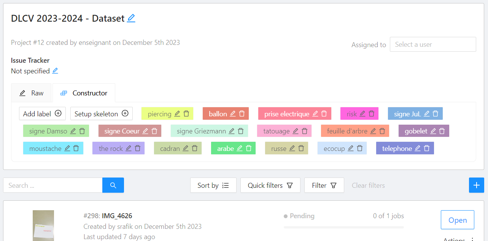

<center>


</center>

## Présentation

Bonjour, bonjour ! Aujourd'hui, plusieurs objectifs :
* finir le *dataset* ;
* faire le *split* train/val/test ;
* développer une application de détection et visualisation dans un flux vidéo ;
* manipuler un apprentissage de YOLOv8.

C'est comme une grille de bingo à remplir. Plus vous en validez, mieux c'est.

On va le diviser en deux : une quête principale, et des quêtes secondaires (des *gamers* par ici ?). La quête principale est l'objectif à atteindre pour terminer la séance de TP d'aujourd'hui (si vous ne les avez pas, je ne pourrai pas utiliser vos données pour lancer les apprentissages :cry:), les quêtes secondaires sont à faire s'il vous reste du temps.


Attention, "Labellisation :frowning_face:" et "L'apprentissage dont vous êtes le héros" sont **nécessaires** pour que je puisse lancer les apprentissages pour la semaine prochaine. Considérez-les comme la quête principale. Si vous avez le temps, réalisez les quêtes annexes : "3,2,1, développez!", "Training COCO", "Feature visualization". 


Les quêtes annexes sont optionnelles, mais considérées comme des bonus pris en compte lors de l'évaluation :wink: 

## Quête principale
### Labellisez :frowning_face:

La semaine dernière dans CVAT, vous avez tou.te.s annoté votre classe d'objets. Nous devons pouvoir récupérer toutes vos données d'ici la fin de séance, sinon vos images ne seviront pas à l'entrainement (ce serait dommage). 




Attention, en regardant certaines séquences, je me suis rendu compte que beaucoup d'annotations s'arrêtaient en cours de vidéo, que certaines qui étaient occultées étaient quand même labellisées comme visibles, etc. 
Je vous demande donc à tous et toutes de vérifier vos labels avant de les valider pour de bon.

:warning: Par ailleurs, changement de stratégie ; nous (les encadrant.e.s) nous chargerons nous-mêmes d'exporter les tâches et d'organiser le *dataset* sur le serveur GPU. La semaine dernière, certaines erreurs bizarres ont popé lors de la copie sur le serveur, alors on va s'éviter du tracas inutile en séance.


**Quand votre labellisation est terminée, venez la valider.**

### L'apprentissage dont vous êtes le héros

Pour celles et ceux qui n'ont pas divisé leur *dataset* en trois fichiers textes `train.txt`, `val.txt` et `test.txt` (cf. TP précédent), c'est l'heure ! 

Vous devez créer trois fichiers : `train.txt`, `val.txt` et `test.txt`. Dans chacun, vous mettrez la liste des chemins d'accès vers les **_images_** (pas les labels) selon qu'elles doivent aller en base d'apprentissage, de validation ou de test. Par exemple, dans `train.txt` :

    ./velo/tic_et_tac/4/images/frame_000002.jpg
    ./velo/tic_et_tac/4/images/frame_000118.jpg
    ...
    ./velo/tic_et_tac/2/images/frame_000004.jpg
    ./velo/tic_et_tac/1/images/frame_000001.jpg
    ./velo/tic_et_tac/3/images/frame_000256.jpg


La répartition de vos données entre les différentes bases est une étape cruciale : 
* allez-vous mettre 3 séquences complètes en `train`, une en `val` et une en `test`, au risque d'avoir des exemples en test qui sont trop éloignés de ceux de la base d'apprentissage ?
* ou bien allez-vous plutôt mettre les débuts de séquence en `train`, les milieux en `val`, les fins en `test`, mais dans ce cas vous biaiserez l'apprentissage et obtiendrez des performances étrangement un peu trop hautes ? 
* vous pouvez aussi choisir la méthode bourrine et faire un random total sur la répartition...


**Spoiler alert :** la première option a tendance à légèrement *overfitter*...



**Ma philosophie...**

Personnellement, quand je vois que je commence à passer plus de temps à écrire un script pour faire une tâche automatiquement qu'à la faire de manière manuelle et pas du tout intelligente... Je préfère la faire de manière manuelle et pas du tout intelligente. Par exemple, en [listant dans un fichier tous les chemins d'accès](https://stackoverflow.com/questions/1767384/how-can-i-get-a-recursive-full-path-listing-one-line-per-file) et en découpant le fichier à la main dans un éditeur de texte. Par exemple, mais on peut trouver plus bête encore, je pense.

Maintenant, si vous êtes des pros de Python, bash, que sais-je, faites-vous plaisir. Il faut juste ne pas y passer toute la séance :wink:



Quand vous avez vos trois fichiers, vous me les envoyez par mail (clairelabitbonis@gmail.com), avec le nom de chacun des membres du binôme, et votre classe labellisée.

### 3, 2, 1, développez !

On arrive enfin à YOLO, depuis le temps qu'on en parle. La première étape consiste à configurer votre *workspace* : allez voir l'annexe [Configuration du *workspace*](https://clairelabitbonis.github.io/posts/teaching/deep_learning_for_cv/practical_sessions_dlcv/2023-2024/02_yolo/#configuration-du-workspace) (elle porte bien son nom). Une fois que c'est fait, voilà les exigences à respecter :
* l'application doit détecter des objets dans un flux vidéo ;
* l'application doit afficher les boites englobantes de détection sur les images traitées ;
* l'application doit afficher l'analyse en temps réel, c'est-à-dire afficher les détections dès que l'analyse est faite ;
* l'application doit colorer les boites englobantes de manière unique en fonction de la classe détectée ;
* l'application ne doit pas être dépendante du nombre ni du nom des classes détectées ; 
* les couleurs choisies pour l'affichage des boites doivent être aussi belles qu'un arc-en-ciel en plein mois d'août :rainbow:.

Les contraintes logicielles sont :
* utiliser Python ;
* utiliser OpenCV ;
* utiliser YOLOv8 (ah bon !).

Pour cette première version et comme les apprentissages sur le *dataset* de cette année ne sont pas encore faits, vous utiliserez YOLO avec des poids pré-entrainés sur COCO. 

Pour réaliser cette quête, la toile de l'Internet est votre amie, avec notamment :
* la [doc d'Ultralytics](https://docs.ultralytics.com);
* [Google](https://www.google.fr);
* ChatGPT : :angry: bouuuh ChatGPT, en plus il connait même pas YOLOv8 parce que c'est trop récent, laissez tomber. [Même s'il est très fort](https://chat.openai.com/share/4c573574-bfad-4b17-a918-9db9fc16f0e1). On appelle ça la _dissonance cognitive_ :


## Quêtes secondaires
### Training COCO128
Pour pouvoir voir YOLO en action, vous allez lancer un apprentissage sur vos machines, sur CPU. Et afin d'éviter de voir vos PC s'envoler vers l'infini et au-delà, on va le faire sur un tout petit *dataset* : COCO 128, qui est une extraction du *dataset* COCO  [Common Objects in Context](https://cocodataset.org/#home).

Toujours, la [doc d'Ultralytics](https://docs.ultralytics.com/modes/train/#key-features-of-train-mode) vous indique comment faire.
Dans un premier temps, tentez un apprentissage sur 3 *epochs* pour voir ce qu'il se passe quand un apprentissage est terminé. 
Tous les éléments liés à l'apprentissage que vous venez de lancer auront été enregistrés dans le dossier `runs/...` quelque chose. Allez voir ce qu'il s'y passe. Allez voir les métriques qu'il sauvegarde, les images qu'il produit dans ce dossier.

Vous pouvez aussi voir comment est écrit le fichier du *dataset*, il est dans `ultralytics/cfg/datasets/coco128.yaml`. Vous serez ravis d'apprendre que le *dataset* COCO permet d'entrainer YOLO à détecter des brocolis.

Quand vous lancez votre script de `train`, vous pouvez ensuite le monitorer avec Tensorboard. Pour cela, ouvrez un autre terminal et entrez `tensorboard --logdir=runs` pour indiquer qu'il faut monitorer le dossier dans lequel YOLO stocke les apprentissages. Il vous ouvre un monitoring sur [https://localhost:6006](https://localhost:6006) par défaut.

> **En mode debug, si vous mettez un point d'arrêt**:
>
> * dans la fonction `_do_train()` du fichier `ultralytics/engine/trainer.py`, vous serez au coeur de la boucle d'apprentissage. A la ligne (environ) 336, vous pouvez voir le contenu du *batch*, vous voyez aussi à ce moment-là le modèle s'exécuter sur le *batch* et renvoyer la *loss* associée.
> 
> 
> * dans la fonction `__init__()` de la classe `DetectionModel` dans `ultralytics/nn/tasks.py`, vous êtes dans la création du réseau de détection. Regardez les autres fonctions (`_predict_augment` qui fait la *data augmentation* au moment de l'apprentissage, ou encore la classe `BaseDataset` dans `ultralytics/data/base.py` qui construit le *dataloader* pour faire les *batches*).
>
> * dans un module en particulier (une convolution dans `ultralytics/nn/modules/conv.py`, la tête `Detect` dans `ultralytics/nn/modules/head.py`), vous pouvez aussi voir l'exécution interne de ces couches au moment où elles sont appelées.
>
> * dans la fonction `forward()` de la `BboxLoss`, dans `ultralytics/utils/loss.py`, vous aurez le détail du calcul de la fonction d'erreur de la détection prédite en fonction du label.
>
> Le *debug*, c'est la vie. N'hésitez pas à mettre des points d'arrêt sur les traces de l'apprentissage pour comprendre ce qui s'y joue. 

### Feature visualization
Quand vous exécutez un modèle sur une image, vous pouvez visualiser les *feature maps* produites par chaque couche en passant l'option `visualize=True` lors de l'inférence. Toutes les *feature maps* et leurs images sont sauvegardées dans un dossier `runs/detect/predict...`. Allez voir à quoi ça ressemble. C'est "intéressant", même s'il y a bien longtemps que j'ai arrêté d'essayer d'interpréter des *feature maps*.


## Annexes
### Configuration du *workspace*

#### Si vous êtes sur vos machines personnelles
C'est très simple et vous avez tous les droits, parce que c'est vous le.a patron.ne.

Il faut juste faire :

```
cd <ou_vous_voulez_mettre_yolo>
git clone --recursive https://github.com/ultralytics/ultralytics.git
cd ultralytics
pip install -r requirements.txt
pip install tensorboard
```

Et hop, c'est plié (normalement, parce qu'il y a toujours des erreurs auxquelles on s'attend pas).

#### Si vous êtes sur les machines de l'INSA

Il faut installer l'environnement virtuel qui va bien pour vous donner les droits d'installation des différentes librairies Python :

```
(base) labi@srv-tp06:~/Bureau$ git clone --recursive https://github.com/ultralytics/ultralytics.git
Clonage dans 'ultralytics'...
remote: Enumerating objects: 20767, done.
remote: Counting objects: 100% (24/24), done.
remote: Compressing objects: 100% (22/22), done.
remote: Total 20767 (delta 4), reused 6 (delta 1), pack-reused 20743
Réception d'objets: 100% (20767/20767), 11.09 Mio | 10.19 Mio/s, fait.
Résolution des deltas: 100% (14636/14636), fait.
Mise à jour des fichiers: 100% (767/767), fait.
(base) labi@srv-tp06:~/Bureau$ cd ultralytics/
(base) labi@srv-tp06:~/Bureau/ultralytics$ python -m venv .env
(base) labi@srv-tp06:~/Bureau/ultralytics$ source .env/bin/activate
(.env) (base) labi@srv-tp06:~/Bureau/ultralytics$ pip install -e .
(.env) (base) labi@srv-tp06:~/Bureau/ultralytics$ pip install tensorboard
```

Une fois dans VSCode, ouvrez le dossier `ultralytics` et avec la palette de commande (`Ctrl + Shift + P`) choisissez l'environnement virtuel que vous venez de créer (`Python: Sélectionner l'interpréteur` > `Python 3.11 (.env)`).

#### Si vous êtes sur vos machines personnelles mais que vous voulez être sur les machines de l'INSA en même temps :exploding_head

Vous pouvez le faire grâce à l'extension (`Ctrl + Shift + X`) de VSCode qui s'appelle `Remote-SSH`, et en ouvrant depuis votre VSCode local une connexion avec `srv-ens-calcul.insa-toulouse.fr`. Il faut que le VPN soit activé, *of course*.

#### Si vous êtes sur les machines de l'INSA et que vous voulez accéder à distance à vos machines personnelles

Faut pas abuser.