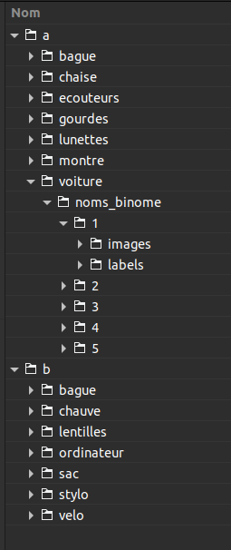

<center>


</center>

## Présentation

L'objectif du TP du jour est d'utiliser le *dataset* construit la semaine dernière pour entrainer YOLOv5 à détecter les classes d'objets annotées.
Voyez-le comme une grille de Bingo à remplir. Plus vous en validez, mieux c'est. 


Attention, "la moulinette des labels" et "split, split, split" sont **nécessaires** pour lancer l'apprentissage en fin de séance. Considérez-les comme la quête principale. Si vous avez le temps, réalisez les quêtes annexes : "seeing data augmentation", "et la valeur du poids est...", "detect with coco.pt" et "où est Charlie ?". 


Les quêtes annexes sont optionnelles, mais considérées comme des bonus pris en compte lors de l'évaluation :wink: 

### Arborescence du *dataset*
Après réorganisation du *dataset* à la suite des TPs de la semaine dernière, l'arborescence est comme suit : 



> Connectez-vous en SSH au serveur GPU, faites une copie vers votre *home* du dossier de votre binôme et fermez la connexion SSH. Les dossiers personnels étant synchronisés, vous avez accès au dossier nouvellement copié dans votre espace personnel. Vous travaillerez dans ce dossier pour réaliser les traitements (ça évitera une mauvaise manip' qui écrase tout sur le serveur...).

## Quête principale
### La moulinette des labels

<!-- 
***/!\ DANGER /!\\*** 

Vous allez travailler dans les dossiers du *dataset* directement. Ne vous trompez pas, n'écrasez pas vos fichiers de labels ou ceux de vos camarades, ce serait dommage, il faudrait tout ré-annoter... :angel:
 -->

La semaine dernière dans CVAT, vous avez tous annoté votre classe d'objet indépendamment des autres binômes. Dans vos fichiers de labels, votre numéro de classe est donc `0`, quelle que soit votre classe. Or pour entrainer un détecteur multi-classes, chaque classe doit porter un indice différent.

> Dans la vraie vie, on crée un projet dans CVAT qui contient toutes les classes d'objets, on ajoute des tâches au projet, on labellise les *jobs*, et à l'export toutes les annotations portent les bons numéros de classes. Mais **(1)** la configuration de CVAT a été *légèrement* chaotique, donc pas de projet, donc pas les bons numéros, et **(2)** de toutes façons, le quotidien de l'ingé *deep learning* n'est fait que de moulinettes et de scripts Python en tout genre, ça tombe bien !

Votre mission est donc de vous placer dans votre dossier, et de remplacer dans chacun des fichiers de label `frame_xxxxxx.txt` le numéro de classe par celui qui vous correspond, d'après le mappage suivant :

```python
  0: claire
  1: pierre
  2: bague
  3: chaise
  4: ecouteurs
  5: gourdes
  6: lunettes
  7: montre
  8: voiture
  9: chauve
  10: lentilles
  11: ordinateur
  12: sac
  13: stylo
  14: velo
```

> **Exemple** avec le fichier `frame_00256.txt` de la classe `lunettes` :
>
> Avant : 
> 
> Après : 

A vous de trouver la meilleure manière de le faire : à la main (ça peut marcher, mais vous y serez encore la semaine prochaine), avec un script *bash*, un script Python, en utilisant des librairies comme `glob` pour parcourir les dossiers, etc.


### *Split, split, split!*
Avant de lancer l'apprentissage, il faut séparer la base en trois sous-ensembles : apprentissage, validation, et test. 

Les fichiers `train.txt`, `val.txt` et `test.txt` doivent contenir les chemins vers les images correspondantes :


A vous de jouer : toujours dans votre dossier (au même niveau que les dossiers 1/2/3/4/5), construisez ces trois fichiers (à l'aide d'une commande `shell`, d'un script ou autre). La répartition entre les trois *sets* est de l'ordre de 65% / 25% / 10%.

### Train

Une fois qu'on aura les trois sous-ensembles pour l'ensemble des classes, on pourra les regrouper dans trois fichiers principaux `train.txt`, `val.txt` et `test.txt` pour tout le *dataset*. Puis on sera en mesure de lancer l'apprentissage correspondant à la configuration que vous avez tirée au sort. 

> Pour cette étape, nous vous demandons simplement de construire la ligne de commande avec les bons paramètres pour votre configuration. Nous (corps enseignant) lancerons les apprentissages en dehors des heures de TP d'ici la semaine prochaine, pour éviter de surcharger le serveur d'un coup. Il faut également avoir rassemblé au préalable toutes les données que vous aurez construites aujourd'hui avant de pouvoir lancer un apprentissage.

Une fois la moulinette et le *split* réalisés, il vous faudra *uploader* votre dossier sur le serveur GPU, à l'emplacement temporaire suivant : `/scratch/labi/DLCV/dataset/tmp/b/<classe>/<votre_dossier>`.

## Quêtes annexes
### *Detect with coco.pt*
Lancez `detect.py` avec les poids `yolov5s.pt` (qui sont pré-entrainés sur COCO) sur des images de votre *dataset* et visualisez les résultats dans `runs/detect/`. Faites-le tourner en mode *debug* pour pouvoir faire du pas à pas, ça vous servira pour la suite.

### Et la valeur du poids est...
Prenez votre date de naissance, additionnez tous les chiffres entre eux récursivement, jusqu'à tomber sur un seul chiffre, \\(x\\).
Prenons \\(j\\) votre jour de naissance et \\(m\\) votre mois de naissance.

> **Exemple** : je suis née le 8 décembre 1991, \\(8+1+2+1+9+9+1 = 31 \rightarrow x = 3+1 = 4\\) ; \\(j=8\\) ; \\(m=12\\).

Quelle est la valeur du poids du filtre de convolution n° \\(j\\) de la couche \\(x\\), à l'indice `[0,0]` du canal \\(m\\) ?

Doliprane ?

Affichez aussi le contenu de la *feature map* après le *backbone*, pour voir.

### *Seeing data augmentation*
> Cette étape sera possible à la séance prochaine, quand le *training* sera correctement configuré.

On veut voir du MixUp ! Modifiez le code pour qu'au moment de l'apprentissage on puisse visualiser la *data augmentation* faite par YOLO. S'il n'y a jamais de MixUp, c'est qu'il est désactivé dans le fichier de configuration des hyperparamètres. Changez les hyperparamètres qui vont bien pour que le MixUp soit effectué avec une probabilité de 0.25.

Vous pouvez aussi afficher le résultat de la mosaïque et d'autres transformations par exemple.
 
### Où est Charlie ? *(ou l'activation du mode hardcore)*

Pour appréhender le fonctionnement de YOLOv5, on peut répondre à un ensemble de questions. Pour en trouver les réponses, plusieurs techniques : Google, fouiner dans le code, exécuter en mode *debug*... L'idée n'est pas de répondre de manière exhaustive (certaines questions peuvent être *tricky* quand on débute en PyTorch), mais d'enclencher la réflexion sur les questions que l'on se pose quand on utilise un réseau. Cela dit, l'objectif est quand même de répondre au maximum de questions :wink:

Les voilà en vrac, on dit merci à Pierre :

#### Questions générales
- Combien de classes y a-t-il dans le *dataset* VisDrone ?
- Quel est le ratio entre le nombre de poids de YOLOv5-S et YOLOv5-L ?
- Quelle différence entre YOLOv5-p2 et YOLOv5-p6 ?
- Que contient le `model.pt` sauvegardé ?
- Quelles tâches d'apprentissage peuvent être réalisées avec YOLO ?
- Quels optimiseurs sont disponibles dans YOLO ?
- Comment fonctionne le *early stopping* dans YOLO ?

#### Questions sur le modèle en lui-même
- Quelle est la *loss* utilisée en détection ?
- Quels types différents de convolutions sont utilisés par YOLO ?
- Quelles couches composent le module "Conv" de YOLO ?
- Quelle différence entre Bottleneck et Bottleneck CSP ?
- Dans un module PyTorch, quelle fonction doit être implémentée pour faire passer les *inputs* dans le réseau ?
- Dans un module PyTorch, quelle fonction doit être implémentée pour que l'apprentissage des poids soit possible ?
- Que fait le SPP ?
- Comment fonctionne et à quoi sert le Focus ? Par quoi aurait-on pu le remplacer ?
- Le Concat est-il utilisé pour fusionner des couches ou bien des *batches* ? (Pourquoi ?)
- Donnez la structure de la sortie de YOLO en détection (bon courage !).

#### Compréhension générale
- Que prédira le réseau si on donne le fichier de configuration avec 80 classes (COCO) mais sur notre *dataset* ?
- Que prédira le réseau avec nos poids sur le *dataset* COCO ?
- Par quoi aurait-on pu remplacer la fonction d'activation SiLU ?
- Proposez une autre approche remplaçant le Concat.
- A quoi sert le *dropout* de YOLO ?
- Est-il possible de *freezer* toutes les couches ? Que se passerait-il ?
- Par quoi peut-on remplacer la fonction UpSample de YOLO ?
- Mieux vaut utiliser YOLOv5-M ou ResNet50 ? Pourquoi ?
- Mieux vaut utiliser YOLOv5-L ou YOLOv5-X ? Pourquoi ?
- Combien de coups de tête Zidane a-t-il donné de plus qu'Ancelotti ?


