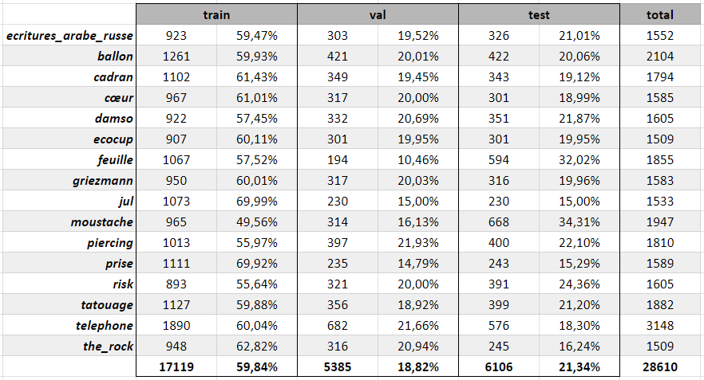
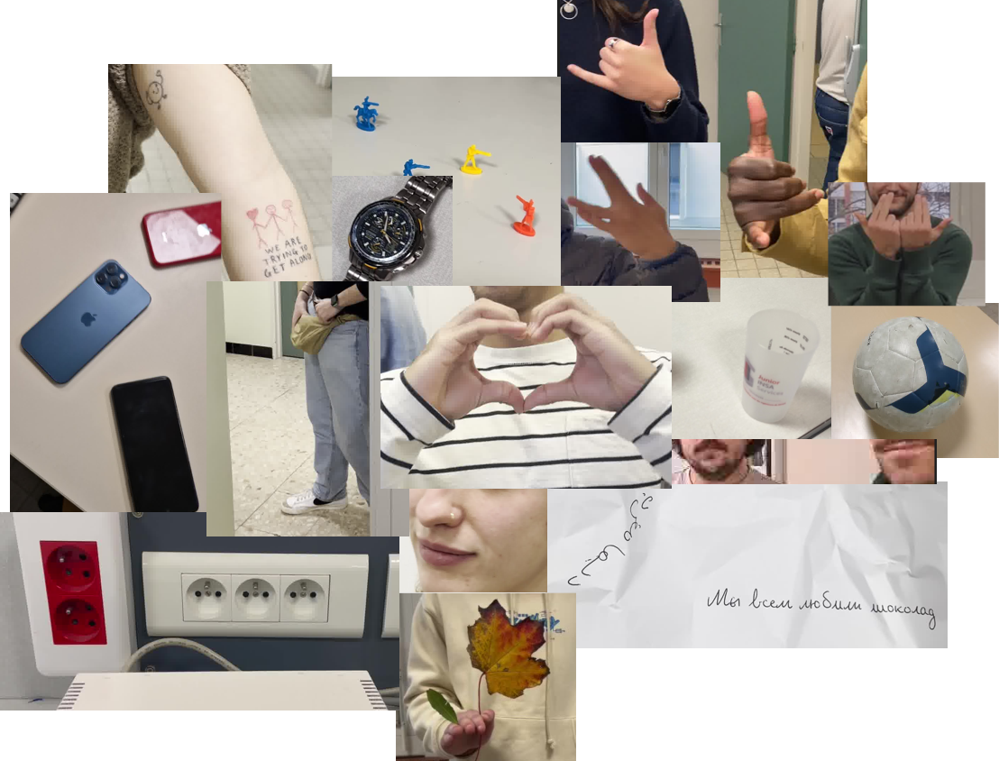
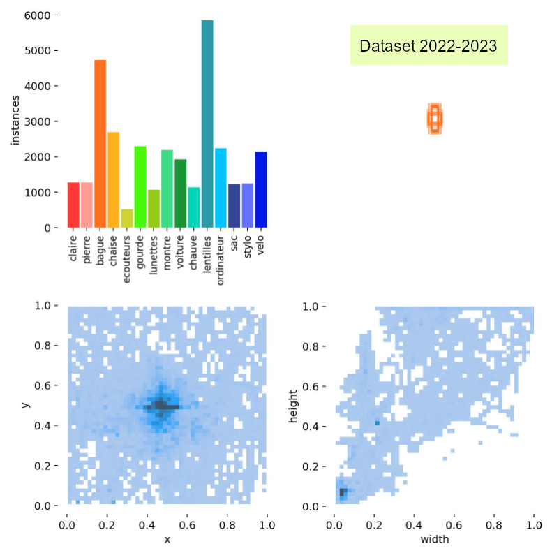
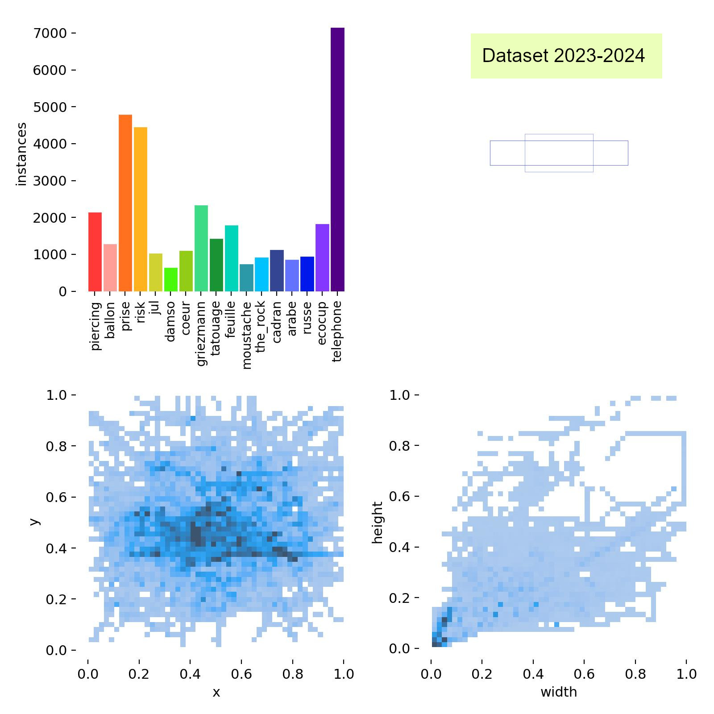
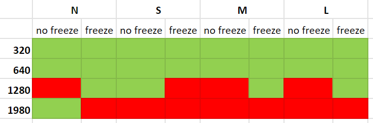
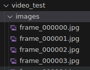
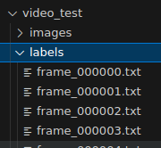
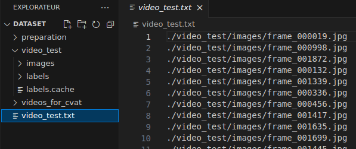
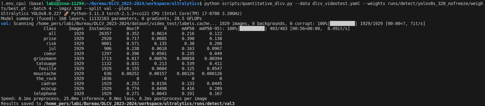

## Présentation

Bonjour, bonjour ! Aujourd'hui, l'objectif est d'évaluer les performances de YOLOv8 sur le *dataset* qu'on a construit ensemble. On ne sera que deux encadrant.e.s pour les trois groupes, alors ça va être sportif. Mais YOLO, on a pas peur.

Comme indiqué dans le sujet de [présentation](https://clairelabitbonis.github.io/posts/teaching/deep_learning_for_cv/practical_sessions_dlcv/2023-2024/00_presentation/), vous devrez rendre début janvier une vidéo d'une dizaine de minutes qui décrit votre travail de TP, et votre analyse des performances de YOLO sur le *dataset*.

Pour cela, vous allez aujourd'hui procéder à :
* une **analyse quantitative** des performances : interpréter des courbes de précision/rappel, des matrices de confusion, des temps de calcul, des tailles de réseau ;
* une **analyse qualitative** des performances : afficher les détections sur la base de *train*, de *test*, sur une nouvelle vidéo, sur de nouvelles images. Voir dans quels cas ça marche, dans quels cas ça marche pas ;

Ces analyses doivent être faites à un niveau **micro** où vous allez vous préoccuper de votre propre classe d'objet (celle que vous avez annotée) et comparer les différentes configurations de modèles, mais aussi à un niveau **macro** où vous allez vous comparer aux autres classes.


Il n'y a pas que ces analyses qui sont demandées pour le rendu. Il faut aussi parler du *dataset*, de votre propre expérience, etc. Regardez bien le sujet de [présentation](https://clairelabitbonis.github.io/posts/teaching/deep_learning_for_cv/practical_sessions_dlcv/2023-2024/00_presentation/).


Le sujet d'aujourd'hui est divisé en deux parties :
* [partie 1](#il-est-tres-beau-le-dataset) : un compte-rendu du *dataset* ainsi qu'une présentation des différents entrainements de YOLO, pour que vous puissiez avoir une vue globale des données, et si j'ai eu le temps je les aurai comparées au *dataset* de l'année précédente (on se voit dans seulement quelques heures, alors je pense honnêtement qu'on est laaaaaarge au niveau du temps qu'il me reste pour rédiger des choses...) ;
* [partie 2](#et-donc-ça-marche) : la description des scripts que j'ai écrits pour vous faciliter la vie, parce que je suis sympa.


## Il est TRES beau le *dataset*

### Répartition des classes

Ensemble, on a construit un TRES beau *dataset* qui nous permet de détecter plein de classes d'objets très utiles, bravo. On pourra par exemple automatiquement dire si on regarde un clip de JuL, de Damso, si on se balade en forêt à l'automne, ou si Dwayne Johnson se cache derrière un buisson - et ça, c'est vraiment super.

Le tableau ci-dessous indique le nombre d'images et la répartition des différentes classes entre les ensembles de *train*, *validation* et *test* :

 <center>



 </center>

Et en voilà une petite illustration :heart: :

 <center>



 </center>

### Analyse des labels
La quantité de labels par image et leur forme varie en fonction des classes annotées. Par exemple, les images de `prise` contiennent beaucoup plus d'instances que la classe `ballon`, pour un nombre équivalent d'images. Par ailleurs, et en mettant ça en regard de l'année passée, les objets ont globalement été plus répartis sur l'ensemble de l'image, là où ceux de l'année dernière étaient très au centre (figures en bas à gauche). Ma première intuition serait de dire que cette année on s'est accordés plus de libertés que l'année dernière sur le fait que les objets devaient être bien centrés, ne pas dépasser, etc. Un peu plus en mode *yolo* quoi.


On voit aussi que les labels de l'année dernière étaient en majorité verticaux, là où cette année on est un peu plus sur des boîtes horizontales (figures en bas à droite).

  <center>




 </center>


## Et donc, ça marche ?

Pour le savoir, vous pourrez utiliser deux scripts (que j'ai codés, donc ils sont certainement buggés, c'est OOOOKKAAAAAY. N'hésitez pas à les modifier pour qu'ils répondent parfaitement à votre besoin ! J'ai même mis des commentaires...) :
* [qualitative_dlcv.py](files/qualitative_dlcv.py) : permet de visualiser l'application d'un réseau sur différents types de sources ;
* [quantitative_dlcv.py](files/quantitative_dlcv.py) : permet de générer des métriques de performances pour une configuration donnée.

En parlant de configurations, cette semaine j'ai pu entrainer [plusieurs versions de YOLO (N, S, M, L)](https://docs.ultralytics.com/models/yolov8/#supported-tasks-and-modes) qui diffèrent par leur nombre de filtres par couche et autres paramètres qui en font des réseaux plus ou moins gros (vous pouvez aller voir le fichier `ultralytics/cfg/models/v8/yolov8.yaml` pour plus de détails), avec des résolutions d'entrée différentes (de 320 à 1980), et en figeant ou non le *backbone* avant l'apprentissage. Au final, on obtient les configurations suivantes :


<center>



</center>

Vous pouvez télécharger le [fichier zip](https://drive.google.com/file/d/1phuoYoy2C7jfXZXp0cSHeISskYDgtWRr/view?usp=drive_link) qui contient tous les *runs* correspondant à ces apprentissages. Ce dossier, `runs`, est à placer à la racine d'`ultralytics`. Chaque sous-dossier contient une configuration donnée, accompagnée de ses courbes d'apprentissage, de ses matrices de confusion et de ses poids (dans `weights`). 

Vous pouvez également télécharger le fichier [dlcv_2023-2024.yaml](files/dlcv_2023-2024.yaml) dont vous avez besoin pour lancer l'évaluation quantitative, (paramètre `--data`, que l'on retrouve aussi à l'apprentissage). Ce fichier est à placer dans `ultralytics/cfg/datasets`, à côté des autres configurations de *datasets*.

Si vous voulez exécuter les scripts en mode `debug`, je vous donne le fichier [.json](files/launch.json) qui va bien. Comme ça vous pouvez directement modifier les *args* dans le fichier de configuration. Il est à placer dans le dossier `.vscode`.

### Analyse qualitative

Le script `qualitative_dlcv.py` prend en entrées 4 paramètres : 
* `weights` qui sera le chemin vers le fichier `.pt` issu de l'apprentissage que vous voulez évaluer ;
* `source` pour indiquer l'entrée que vous donnerez au réseau. Vous pouvez mettre soit `folder`, `txt_file`, `video` ou `webcam` pour indiquer que vous donnerez un dossier avec des images `.jpg` à l'intérieur, un fichier similaire à `train.txt` avec les chemins vers les images, une vidéo ou une webcam ;
* `path` nécessaire dans le cas où vous avez mis `video`, `folder` ou `txt_file` ;
* `display_size` : la taille à laquelle l'image sera retaillée avant d'être passée au réseau et affichée.

Quelques exemples d'appels :

```
python qualitative_dlcv.py --weights runs/detect/yolov8s_640_freeze/weights/best.pt --source folder --path /scratch/labi/DLCV/2023-2024/dataset --display_size 640

python qualitative_dlcv.py --weights runs/detect/yolov8m_320_nofreeze/weights/best.pt --source video --path video.mp4 --display_size 320
```

Si vous voulez avoir accès au *dataset* complet dans `/scratch/labi/DLCV/2023-2024/dataset`, il faut que vous soyez en [Remote-SSH](https://clairelabitbonis.github.io/posts/teaching/deep_learning_for_cv/practical_sessions_dlcv/2023-2024/02_yolo/#si-vous-%C3%AAtes-sur-vos-machines-personnelles-mais-que-vous-voulez-travailler-sur-les-machines-de-linsa-exploding_head) sur le `srv-gei-gpu2`. Si vous restez en local, vous devez avoir un dossier qui contient des images, ou une vidéo, ou un fichier texte avec les chemins vers les images, ou... une webcam.

### Analyse quantitative

Pour l'analyse quantitative, vous avez dans tous les sous-dossiers de `runs` les matrices de confusion et courbes en tout genre qui vous permettront d'analyser les performances des configurations entrainées.

Vous pouvez également utiliser le script `quantitative_dlcv.py` qui prend en entrées plusieurs paramètres.

Exemple : j'ai une vidéo de test avec ses labels, exportés depuis CVAT, et je veux effectuer une analyse quantitative dessus.

D'abord, l'arborescence des fichiers et le `.txt` associé (ignorez les dossiers "preparation" et "videos_for_cvat", j'ai juste pas eu le temps de les enlever...) :

<center>





</center>

Si vous créez un nouveau `.json` pour tester ce *dataset* en particulier (à placer dans `ultralytics/cfg/datasets`), et que vous exécutez le script avec les bons paramètres, vous aurez une évaluation d'un modèle donné sur ce *dataset*-là :

<center>



</center>

### Pour info

Je vous ai mis un [script d'apprentissage](files/train_dlcv.py) formaté de la même manière, si ça peut vous être utile (a priori pas d'apprentissage aujourd'hui).
