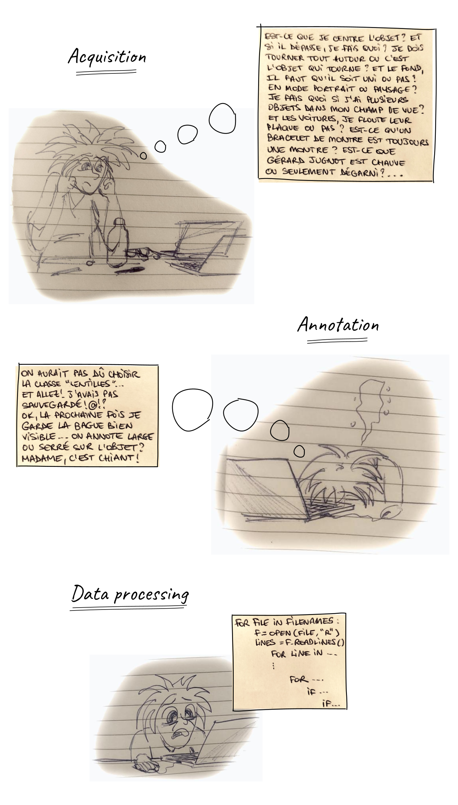
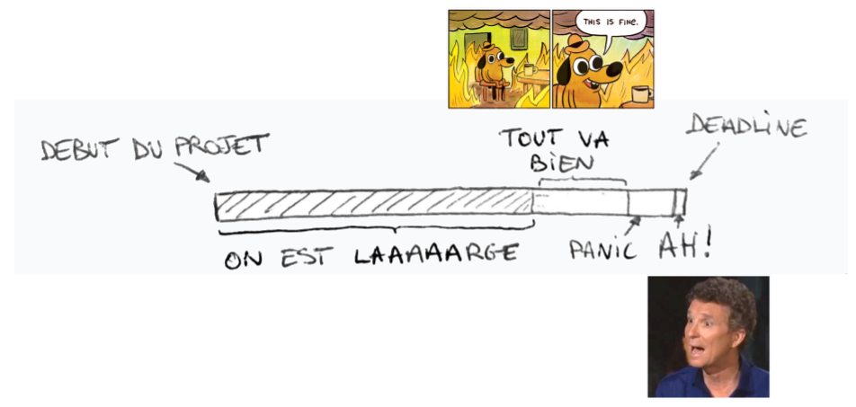
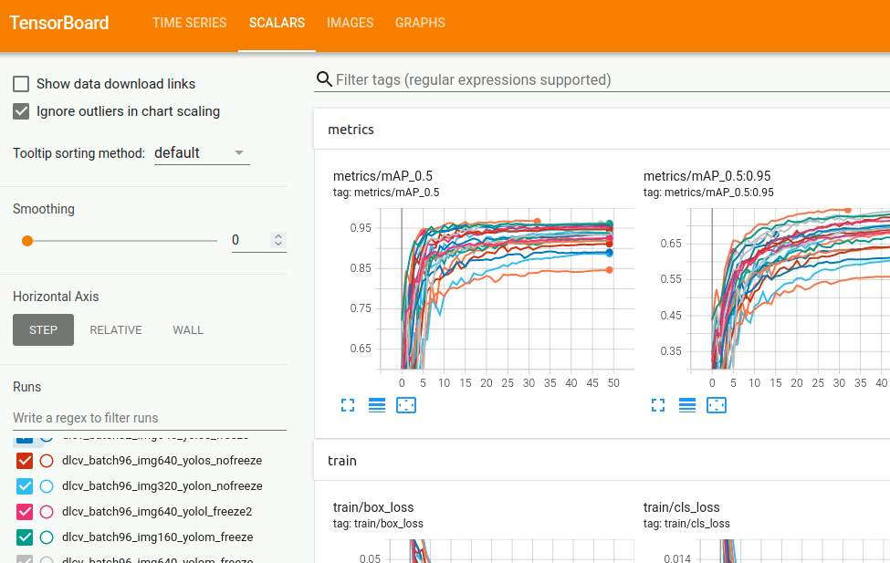

## **Previously on "DLCV Practical sessions"...**

 

 

## Présentation

Bonjour, bonjour ! Aujourd'hui, l'objectif est d'évaluer les performances de YOLOv8 sur le *dataset* qu'on a construit ensemble. On ne sera que deux encadrant.e.s pour les trois groupes, alors ça va être sportif. Mais YOLO, on a pas peur.

Comme indiqué dans le sujet de [présentation](https://clairelabitbonis.github.io/posts/teaching/deep_learning_for_cv/practical_sessions_dlcv/2023-2024/00_presentation/), vous devrez rendre début janvier une vidéo d'une dizaine de minutes qui décrit votre travail, et votre analyse des performances de YOLO sur le *dataset*.

Pour cela, vous allez aujourd'hui procéder à :
* une **analyse quantitative** des performances : interpréter des courbes de précision/rappel, des matrices de confusion, des temps de calcul, des tailles de réseau ;
* une **analyse qualitative** des performances : afficher les détections sur la base de *train*, de *test*, sur une nouvelle vidéo, sur de nouvelles images. Voir dans quels cas ça marche, dans quels cas ça marche pas ;

Ces analyses doivent être faites à un niveau **micro** où vous allez vous préoccuper de votre propre classe d'objet (celle que vous avez annotée) et comparer les différentes configurations de modèles, mais aussi à un niveau **macro** où vous allez vous comparer aux autres classes.


Il n'y a pas que ces analyses qui sont demandées pour le rendu. Il faut aussi parler du *dataset*, de votre propre expérience, etc. Regardez bien le sujet de [présentation](https://clairelabitbonis.github.io/posts/teaching/deep_learning_for_cv/practical_sessions_dlcv/2023-2024/00_presentation/).


Le sujet d'aujourd'hui est divisé en trois parties :
* [partie 1](#il-est-tres-beau-le-dataset) : un compte-rendu du *dataset* ainsi qu'une présentation des différents entrainements de YOLO, pour que vous puissiez avoir une vue globale des données, et si j'ai eu le temps je les aurai comparées au *dataset* de l'année précédente (on se voit dans seulement quelques heures, alors je pense honnêtement qu'on est laaaaaarge au niveau du temps qu'il me reste pour rédiger des choses...) ;
* [partie 2](#et-du-coup-ça-marche) : la description des scripts que j'ai écrits pour vous faciliter la vie, parce que je suis sympa ;
* [partie 3](#ce-que-vous-navez-pas-vu) : en vrac, ce que j'ai dû faire depuis la dernière séance pour qu'on ait un joli TP aujourd'hui.

## Il est TRES beau le *dataset*

### Répartition des classes

Ensemble, on a construit un TRES beau *dataset* qui nous permet de détecter plein de classes d'objets très utiles, bravo. On pourra par exemple automatiquement dire si on regarde un clip de JuL, de Damso, si on se balade en forêt à l'automne, ou si Dwayne Johnson se cache derrière un buisson - et ça, c'est vraiment super.

Le tableau ci-dessous indique le nombre d'images et la répartition des différentes classes entre les ensembles de *train*, *validation* et *test* :

 

 

Et en voilà une petite illustration :heart: :

 

 

### Analyse des labels
La quantité de labels par image et leur forme varie en fonction des classes annotées. Par exemple, les images de `prise` contiennent beaucoup plus d'instances que la classe `ballon`, pour un nombre équivalent d'images. Par ailleurs, et en mettant ça en regard de l'année passée, les objets ont globalement été plus répartis sur l'ensemble de l'image, là où ceux de l'année dernière étaient très au centre (figures en bas à gauche). Ma première intuition serait de dire que cette année on s'est accordés plus de libertés que l'année dernière sur le fait que les objets devaient être bien centrés, ne pas dépasser, etc. Un peu plus en mode *yolo* quoi.

On voit aussi que les labels de l'année dernière étaient en majorité verticaux, là où cette année on est un peu plus sur des boîtes horizontales (figures en bas à droite).

  

 

## Et du coup, ça marche ?

### Je suis sympa

## :metal: Une semaine pour tout changer :metal:

### Ce que vous n'avez pas vu... 

* <mark>**encore plus de *data processing***</mark> : après l'*upload* de toutes vos données sur le serveur la semaine dernière, il a fallu les homogénéiser. Certains fichiers contenaient des espaces en trop, les *splits* n'étaient pas toujours formatés de la même manière, l'arborescence était parfois à réorganiser, *etc*. 
* <mark>***get ready for training***</mark> : une fois le *dataset* formaté, il faut préparer YOLO pour l'apprentissage, et notamment écrire le fichier de configuration qui va bien pour un apprentissage sur des données *custom* :

&nbsp;

* <mark>**la lente agonie des GPUs**</mark> : à l'heure où j'écris ces lignes (14 décembre à ~minuit), nous en sommes à 44 heures d'apprentissage, réparties sur les 8 GPUs des serveurs 1 et 2 de l'INSA, et chaque GPU a 8Go de mémoire :

&nbsp;

&nbsp;

* <mark>**raté, on recommence -- ou "ce qui était prévu mais qui n'a pas marché"**</mark> : le VPN se déconnecte, la connexion SSH se ferme et arrête une liste d'apprentissages fièrement lancés pour tourner toute la nuit (on t'avait pourtant prévenue de faire un `nohup` ou d'utiliser `tmux`) ; les classes ne sont pas les bonnes, le *batch* est trop gros et explose la mémoire, le *batch* est trop petit et explose le temps, le réseau est trop lourd et fait exploser CUDA.

### Configurations entrainées
Les apprentissages faits ces derniers jours couvrent les configurations suivantes (en vert ce qui est fait, en jaune ce qui est en cours, en rouge ce qu'il reste à faire) : 

&nbsp;

Il était prévu de travailler avec différentes tailles de *batch*, en l'occurrence 1 et 32. Finalement, un *batch* de 1 prend beaucoup trop de temps ; toutes les configurations ont été entrainées avec un *batch* de 64, voire de 96.

[Quatre versions](https://github.com/ultralytics/yolov5#pretrained-checkpoints) de YOLO ont finalement été testées, avec de la plus petite à la plus grande : `n`, `s`, `m`, et `l`. Le détail de ces architectures est visible soit dans Tensorboard en visualisant le graphe d'une configuration correspondant à la version choisie, soit directement dans les fichiers `.yaml` du dossier `models` dans le *workspace* yolov5.

#### *Transfer learning, fine-tuning, pre-trained models...*
`freeze` veut dire qu'en début d'apprentissage, les poids sont initialisés avec un modèle pré-entrainé sur le *dataset* COCO, et que les poids de certaines courches ne sont pas mis à jour pendant l'apprentissage. Dans notre cas, on *freeze* le *backbone*. On "transfère" également la tâche apprise par le réseau pré-entrainé vers une nouvelle tâche, en changeant le nombre et le type des classes à prédire dans notre cas. On dit également qu'on "affine" l'extraction des caractéristiques pré-entrainée en mettant à jour tout ou partie des poids pendant l'apprentissage.

## :fire: *And now, what?* :fire:

On va de nouveau tirer au sort les configurations sur lesquelles vous vous positionnerez, puisque rien ne s'est passé comme prévu pendant les apprentissages. Mais on est agiles, on s'adapte. Le plan sera ensuite le suivant :

* vous mettrez en place votre *workspace*, à savoir : le clone de yolov5 dans votre *home directory*, ouvert dans VS Code avec un accès en SSH au serveur GPU `srv-gei-gpu1` grâce à l'extension "Remote SSH" (`Ctrl+Shitf+X` pour ouvrir le gestionnaire d'extensions), ainsi que l'activation de l'environnement virtuel qui va bien -- cf. partie "configuration du *workspace*" ;
* vous pouvez lancer un `tensorboard --logdir=/scratch/labi/DLCV/train` pour visualiser et comparer les différents apprentissages réalisés ;
* vous pouvez également ouvrir *via* VS Code en SSH le dossier `/scratch/labi/DLCV/train` en question, et ainsi accéder à tous les graphiques de performance générés par YOLO pour chaque configuration d'apprentissage (matrices de confusion, courbes de précision-rappel, F1-score *vs.* score de confiance, *etc*.) ;
* pour évaluer plus en détails votre configuration (notamment sur la base de test), il vous faudra copier le fichier `/scratch/labi/DLCV/dataset/dlcv.yaml` dans votre dossier `path/to/yolov5/data/` puis appeler le script `val.py` avec les paramètres qui vous intéressent. Plusieurs tâches d'évaluations sont possibles : `train`, `val`, `test`, `speed`, `study`. Par exemple, l'évaluation sur base de test pour la configuration ;
* évaluez également les modèles de manière qualitative, c'est-à-dire en visualisant directement les résultats, "à l'oeil". Pour cela, lancez `detect.py` sur une nouvelle vidéo par exemple (pas besoin d'extraire les *frames*, le script prend aussi des vidéos `.mp4` en entrée). Le résultat est stocké dans `path/to/yolo/runs/detect/exp_name`. Vous pouvez changer `exp_name` avec l'option `--name` (plus pratique pour s'y retrouver que d'avoir `exp1`, `exp2`, `exp3`...) 

Ne partez pas ! Vous vous souvenez des quêtes annexes du Bingo de YOLO ? Je vous les remets en mémoire juste au cas où... parce que maintenant que tout roule, vous pouvez lancer la détection avec des poids COCO, faire du pas à pas en mode *debug* pour aller chercher la valeur du poids, visualiser la *data augmentation* faite quand on lance `train.py`, *etc*.

