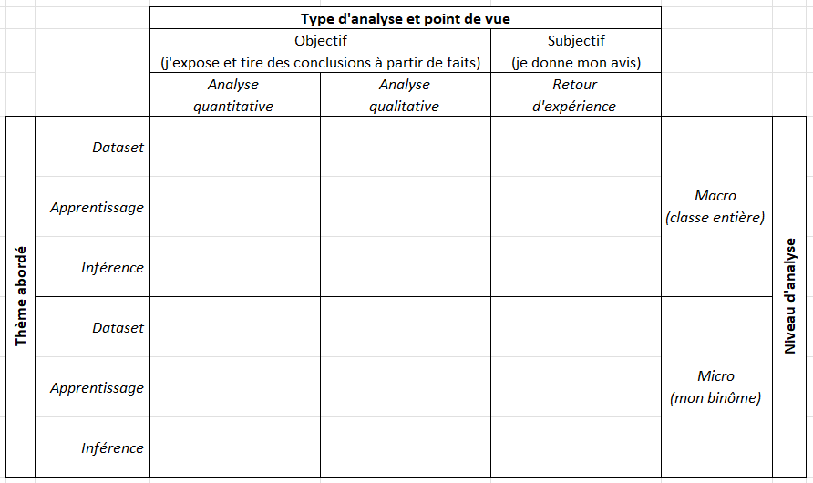


Par souci de clarté, je récapitule tout ici (modalités d'évaluation, exécution des codes d'évaluation, etc.). Comme ça, pas besoin d'aller vous perdre dans les différents sujets.


## 2024 ne fait que commencer... 

### Contenu de votre oeuvre
#### Contraintes de rendu
Bonjour, bonjour ! Une nouvelle année commence, et quoi de mieux pour commencer l'année qu'un peu d'analyse qualitative et quantitative de YOLO sur [notre super *dataset*](https://clairelabitbonis.github.io/posts/teaching/deep_learning_for_cv/practical_sessions_dlcv/2023-2024/03_lets_see/#il-est-tres-beau-le-dataset) ? 

L'évaluation de la matière *deep learning* sera faite sur une vidéo :
* d'environ 10 minutes par binôme1 ;
* dont le format est libre2, dans la limite de 256 Mo3 ;
* qu'il faudra déposer [sur Moodle](https://moodle.insa-toulouse.fr/course/view.php?id=1154&section=4) **avant** 20h, le 19 janvier 20244.


1. ça veut dire que 00:09:50 c'est OK, 00:11:32 ça passe, mais 00:03:00 c'est trop court et 00:45:00 c'est trop long. Et ça veut aussi dire que les deux membres du binôme doivent être perceptibles dans la vidéo *i.e.,* qu'on puisse vous voir ou vous entendre (selon si vous vous filmez ou non). Si vous êtes en monôme, je me contenterai de vous écouter, vous tout seul (pas besoin de faire parler votre ami imaginaire, même si je suis sûre qu'il s'entendrait bien avec le mien :wink:). On peut généraliser cette règle à "chacun doit s'exprimer", c'est donc valable pour les trinômes, les quadrinômes, ...les octonômes. Je m'arrête là, j'ai du travail.
2. une vidéo d'un PowerPoint qui défile avec du bon vieux WordArt et du Comic Sans MS, sur fond de voix monotone qui raconte l'histoire de YOLOv8 du Moyen-Âge à nos jours - avec des témoignages d'époque bien sûr ; ou bien une superproduction hollywoodienne en images de synthèse avec du *ray tracing* et un meilleur scénario qu'Avatar (je vous facilite un peu la tâche, je suis sympa), vous faites comme vous voulez - vendez-nous du rêve. Ce qui m'intéresse, c'est que vous preniez suffisamment de plaisir à le faire pour que ça ne soit pas (trop) une corvée, et surtout que votre contenu soit __pertinent__.
3. si les 256 Mo sont trop difficiles à atteindre, donnez-nous un lien [Youtube vers votre vidéo par exemple](https://youtu.be/eBGIQ7ZuuiU). Ou Drive. Ou autre. On est à l'ère du numérique, on trouvera une solution.
4. ça veut dire que le 19 janvier à 19:32:12 c'est OK, mais que si la vidéo met 2h à s'*uploader*, c'est pas OK. Et ça veut dire qu'à 20:00:00 le 19 janvier, je n'existe plus.


#### Critères d'évaluation

Votre vidéo devra contenir votre analyse de plusieurs sujets, sous des angles qui peuvent être multiples. Globalement, on aura :
* les <mark>trois grandes thématiques</mark> vues en cours et en TP qui pourront donner lieu à analyse : 
  * le ***dataset*** (acquisition, annotation), 
  * l'**apprentissage**, 
  * et l'**inférence** (= la détection appliquée à des données inconnues ou de test avec le modèle entrainé) ;
* <mark>trois types d'analyse</mark> possibles pour chaque thématique :
  * l'**analyse quantitative**, c'est-à-dire qui s'appuie sur des chiffres, des mesures, des courbes, comme par exemple la répartition des classes, le nombre d'instances annotées, le temps d'exécution du réseau en fonction de sa taille, la résolution image, les métriques de performance en fonction du *split*, de la classe, etc.,
  * l'**analyse qualitative** qui consiste à analyser visuellement les performances d'une configuration de réseau donnée. Par exemple, se rendre compte que les petits réseaux ont plus de mal à détecter les petits objets, que les ballons bien centrés dans l'image sont bien détectés, mais que dès lors qu'on s'en éloigne ça ne marche plus (faire le lien avec l'annotation qui a été faite), ou que toute écriture sur fond jaune est détectée comme de l'arabe parce que toutes les phrases en arabe étaient fluotées en jaune dans la base d'apprentissage ; vous voyez l'idée,
  * le **retour d'expérience** : je vous demande votre avis ! Comment vous êtes-vous réparti l'annotation dans le binôme ? Entre différents binômes qui ont annoté la même classe ? Quelles difficultés avez-vous rencontrées ? Quelles questions vous êtes-vous posées au moment de l'acquisition ? Que feriez-vous différemment ? Quelle a été votre stratégie pour choisir vos exemples d'inférence ? Comment avez-vous décidé de la répartition entre les différents *splits* de *train*, *val* et *test* ? 
* chaque type d'analyse peut être fait à <mark>deux niveaux</mark> :
  * **micro** : analyse binôme-centrée, vous parlez de vous et seulement de vous, de votre classe d'objet (métriques de performance sur train/val/test, quantité annotée, type d'annotation, nombre d'instances par image, stratégie d'annotation, etc.), de la comparaison de différentes configurations de réseaux sur votre classe à vous (temps d'exécution, taille du réseau, place mémoire, nombre de couches, de paramètres, analyse des courbes F1, PR, etc.),
  * **macro** : vous *vs.* la promo entière. Par exemple, une analyse plus globale qui compare les différentes courbes F1 des différents apprentissages -- quelle est l'influence de la taille du réseau ? Quelle configuration converge le mieux ? Le plus rapidement ? Laquelle gère mieux les petits objets ? Quelle classe se distingue des autres et pourquoi ? Quelle a été la dynamique de groupe globalement ? Quelles discussions avez-vous eues avec les autres binômes pour vous accorder sur une stratégie d'annotation ? 

Pour résumer ces critères d'évaluation, voilà un joli tableau :

### Pour vous aider

#### Organisation du *dataset*
Pour rappel, le *dataset* se situe à l'adresse `/scratch/labi/DLCV/2023-2024/dataset/` sur le `srv-gei-gpu2` de l'INSA, et contient autant de dossiers que de classes d'objets, ainsi que trois fichiers `train.txt`, `val.txt`, et `test.txt` qui contiennent l'ensemble des *splits* que vous avez faits en TP en prévision des apprentissages :

Dans chaque sous-dossier de classe, un dossier par binôme contient les dossiers de chacune des séquences annotées. Vous y trouverez également les fichiers `train.txt`, `val.txt`, et `test.txt` ne contenant **que votre** répartition (contrairement aux trois fichiers précédents qui contiennent la totalité du *dataset*) : 

#### Organisation des apprentissages
Vous avez à votre disposition sur `srv-gei-gpu2` l'ensemble des apprentissages que j'ai lancés avec différentes versions de YOLO, différentes résolutions, et avec/sans stratégie de *fine tuning*1 :


1. *fine-tuner* un apprentissage, ça veut dire qu'au lancement on charge le modèle avec des poids pré-entrainés sur un *dataset* (en l'occurrence le *dataset* COCO), et qu'on en gèle une partie (ces poids-là ne seront pas mis à jour pendant l'apprentissage). En général, on gèle le *backbone* et on n'apprend que les poids de la tête de prédiction : on spécialise un réseau pour une nouvelle tâche. Ca permet de gagner du temps en apprentissage, tout en bénéficiant de la connaissance d'apprentissages déjà faits par d'autres.


#### Utilisation des scripts Python

En TP, nous vous avions fourni trois scripts Python pour l'apprentissage, l'analyse quantitative et l'analyse qualitative.